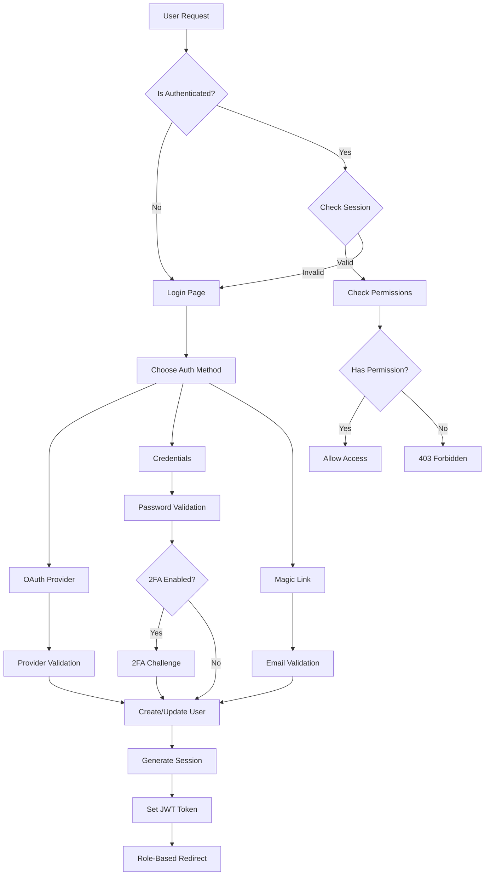

# 🔐 Enterprise Authentication Architecture for Taxomind LMS

## Executive Summary

This document outlines a comprehensive, enterprise-grade authentication architecture for Taxomind - a Bloom's Taxonomy-based Learning Management System marketplace where users can create, share, sell, and learn from courses.

## 🎯 Current State Analysis

### Existing Implementation
- **Framework**: NextAuth.js v5 (Auth.js)
- **Session Strategy**: JWT-based with 30-day expiry
- **Providers**: Google, GitHub, Credentials
- **Roles**: USER, ADMIN, STUDENT, TEACHER (inconsistent usage)
- **2FA**: Basic implementation exists
- **Database**: PostgreSQL with Prisma ORM

### 🚨 Critical Issues Identified

1. **Role Confusion**: 
   - Schema defines 4 roles (USER, ADMIN, STUDENT, TEACHER)
   - Middleware only handles 2 roles (USER, ADMIN)
   - No clear permission boundaries

2. **Weak Authorization**:
   - No granular permissions system
   - Role-based access control is primitive
   - No resource-level permissions

3. **Security Gaps**:
   - No rate limiting on auth endpoints
   - Missing audit logging for sensitive operations
   - No session invalidation mechanism
   - Weak password requirements

4. **Marketplace Requirements Missing**:
   - No seller verification system
   - No payment provider authentication
   - Missing multi-tenancy support
   - No API key management for course creators

## 🏗️ Proposed Architecture

### 1. Enhanced Role & Permission System

```typescript
// New Role Structure
enum UserRole {
  ADMIN        // Platform administrators
  INSTRUCTOR   // Course creators/sellers
  LEARNER      // Students/course consumers
  MODERATOR    // Content moderators
  AFFILIATE    // Affiliate marketers
}

// Granular Permissions
enum Permission {
  // Course Permissions
  COURSE_CREATE
  COURSE_EDIT_OWN
  COURSE_EDIT_ANY
  COURSE_DELETE_OWN
  COURSE_DELETE_ANY
  COURSE_PUBLISH
  COURSE_UNPUBLISH
  COURSE_PRICE_SET
  
  // Content Permissions
  CONTENT_MODERATE
  CONTENT_APPROVE
  CONTENT_FLAG
  
  // User Permissions
  USER_VIEW_ANALYTICS
  USER_MANAGE_OWN
  USER_MANAGE_ANY
  USER_BAN
  USER_VERIFY_INSTRUCTOR
  
  // Financial Permissions
  PAYMENT_RECEIVE
  PAYMENT_WITHDRAW
  PAYMENT_VIEW_REPORTS
  
  // Platform Permissions
  PLATFORM_ADMIN
  PLATFORM_ANALYTICS
  PLATFORM_SETTINGS
}
```

### 2. Database Schema Updates

```prisma
// Enhanced User Model
model User {
  id                    String              @id @default(cuid())
  email                 String              @unique
  emailVerified         DateTime?
  name                  String?
  password              String?
  
  // Enhanced Role System
  role                  UserRole            @default(LEARNER)
  permissions           Permission[]        
  customPermissions     Json?               // For special cases
  
  // Instructor Verification
  instructorStatus      InstructorStatus    @default(PENDING)
  instructorVerifiedAt  DateTime?
  instructorTier        InstructorTier      @default(BASIC)
  
  // Security
  isTwoFactorEnabled    Boolean             @default(false)
  isAccountLocked       Boolean             @default(false)
  lockReason            String?
  lastLoginAt           DateTime?
  lastLoginIp           String?
  failedLoginAttempts   Int                 @default(0)
  
  // Marketplace
  stripeAccountId       String?             // For receiving payments
  paypalAccountId       String?
  walletBalance         Decimal             @default(0)
  
  // Analytics & Gamification
  bloomsLevel           Json?               // Bloom's taxonomy progress
  learningStyle         LearningStyle?
  totalCoursesCreated   Int                 @default(0)
  totalCoursesSold      Int                 @default(0)
  totalRevenue          Decimal             @default(0)
  rating                Decimal?            // Instructor rating
  
  // Relations
  sessions              Session[]
  apiKeys               ApiKey[]
  auditLogs             AuditLog[]
  notifications         Notification[]
  courses               Course[]
  enrollments           Enrollment[]
  purchases             Purchase[]
  reviews               Review[]
  certificates          Certificate[]
  
  @@index([email])
  @@index([role])
  @@index([instructorStatus])
}

enum InstructorStatus {
  PENDING
  VERIFIED
  SUSPENDED
  REJECTED
}

enum InstructorTier {
  BASIC       // Can create up to 5 courses
  STANDARD    // Can create up to 20 courses
  PREMIUM     // Unlimited courses
  ENTERPRISE  // Custom limits & features
}

enum LearningStyle {
  VISUAL
  AUDITORY
  KINESTHETIC
  READING_WRITING
}

// Session Management
model Session {
  id            String    @id @default(cuid())
  userId        String
  token         String    @unique
  userAgent     String?
  ipAddress     String?
  deviceInfo    Json?
  createdAt     DateTime  @default(now())
  expiresAt     DateTime
  lastActivity  DateTime  @default(now())
  isActive      Boolean   @default(true)
  
  user          User      @relation(fields: [userId], references: [id], onDelete: Cascade)
  
  @@index([userId])
  @@index([token])
  @@index([expiresAt])
}

// API Key Management
model ApiKey {
  id            String    @id @default(cuid())
  userId        String
  name          String
  key           String    @unique
  hashedKey     String    @unique
  permissions   Json      // Scoped permissions
  rateLimit     Int       @default(1000) // Requests per hour
  lastUsedAt    DateTime?
  expiresAt     DateTime?
  isActive      Boolean   @default(true)
  createdAt     DateTime  @default(now())
  
  user          User      @relation(fields: [userId], references: [id], onDelete: Cascade)
  
  @@index([hashedKey])
  @@index([userId])
}

// Audit Logging
model AuditLog {
  id            String    @id @default(cuid())
  userId        String?
  action        String
  resource      String
  resourceId    String?
  oldValue      Json?
  newValue      Json?
  ipAddress     String?
  userAgent     String?
  metadata      Json?
  createdAt     DateTime  @default(now())
  
  user          User?     @relation(fields: [userId], references: [id])
  
  @@index([userId])
  @@index([action])
  @@index([resource])
  @@index([createdAt])
}
```

### 3. Authentication Flow Architecture



### 4. Implementation Plan

#### Phase 1: Core Authentication (Week 1-2)

```typescript
// auth.config.ts - Enhanced configuration
import type { NextAuthConfig } from "next-auth";
import Credentials from "next-auth/providers/credentials";
import Google from "next-auth/providers/google";
import GitHub from "next-auth/providers/github";
import Email from "next-auth/providers/email";
import { PrismaAdapter } from "@auth/prisma-adapter";
import { db } from "@/lib/db";

export default {
  adapter: PrismaAdapter(db),
  providers: [
    Google({
      clientId: process.env.GOOGLE_CLIENT_ID,
      clientSecret: process.env.GOOGLE_CLIENT_SECRET,
      authorization: {
        params: {
          prompt: "consent",
          access_type: "offline",
          response_type: "code"
        }
      },
      profile(profile) {
        return {
          id: profile.sub,
          name: profile.name,
          email: profile.email,
          image: profile.picture,
          role: "LEARNER", // Default role
        };
      },
    }),
    GitHub({
      clientId: process.env.GITHUB_CLIENT_ID,
      clientSecret: process.env.GITHUB_CLIENT_SECRET,
    }),
    Email({
      server: {
        host: process.env.EMAIL_SERVER_HOST,
        port: process.env.EMAIL_SERVER_PORT,
        auth: {
          user: process.env.EMAIL_SERVER_USER,
          pass: process.env.EMAIL_SERVER_PASSWORD
        }
      },
      from: process.env.EMAIL_FROM,
    }),
    Credentials({
      id: "credentials",
      name: "Credentials",
      credentials: {
        email: { label: "Email", type: "email" },
        password: { label: "Password", type: "password" }
      },
      async authorize(credentials) {
        // Enhanced validation with rate limiting
        const { email, password } = credentials;
        
        // Check rate limit
        const attempts = await checkLoginAttempts(email);
        if (attempts > 5) {
          throw new Error("Too many login attempts");
        }
        
        const user = await db.user.findUnique({
          where: { email },
          include: {
            permissions: true,
            apiKeys: true
          }
        });
        
        if (!user || !user.password) {
          await incrementLoginAttempts(email);
          return null;
        }
        
        if (user.isAccountLocked) {
          throw new Error("Account is locked");
        }
        
        const isValid = await verifyPassword(password, user.password);
        
        if (!isValid) {
          await incrementLoginAttempts(email);
          return null;
        }
        
        // Reset failed attempts on successful login
        await db.user.update({
          where: { id: user.id },
          data: {
            failedLoginAttempts: 0,
            lastLoginAt: new Date(),
            lastLoginIp: getClientIp()
          }
        });
        
        // Audit log
        await createAuditLog({
          userId: user.id,
          action: "LOGIN",
          resource: "AUTH",
          metadata: { method: "credentials" }
        });
        
        return {
          id: user.id,
          email: user.email,
          name: user.name,
          role: user.role,
          permissions: user.permissions
        };
      }
    })
  ],
  pages: {
    signIn: "/auth/login",
    signOut: "/auth/logout",
    error: "/auth/error",
    verifyRequest: "/auth/verify",
    newUser: "/auth/onboarding"
  },
  session: {
    strategy: "jwt",
    maxAge: 30 * 24 * 60 * 60, // 30 days
    updateAge: 24 * 60 * 60, // 24 hours
  },
  callbacks: {
    async signIn({ user, account, profile }) {
      // Check if user is banned
      const dbUser = await db.user.findUnique({
        where: { email: user.email }
      });
      
      if (dbUser?.isAccountLocked) {
        return false;
      }
      
      // For OAuth, create user if doesn't exist
      if (account?.provider !== "credentials") {
        if (!dbUser) {
          await db.user.create({
            data: {
              email: user.email,
              name: user.name,
              image: user.image,
              role: "LEARNER",
              emailVerified: new Date()
            }
          });
        }
      }
      
      return true;
    },
    
    async jwt({ token, user, account, trigger }) {
      if (user) {
        token.id = user.id;
        token.role = user.role;
        token.permissions = user.permissions;
        
        // Check instructor status
        const instructor = await db.user.findUnique({
          where: { id: user.id },
          select: {
            instructorStatus: true,
            instructorTier: true
          }
        });
        
        token.instructorStatus = instructor?.instructorStatus;
        token.instructorTier = instructor?.instructorTier;
      }
      
      // Refresh token data periodically
      if (trigger === "update") {
        const freshUser = await db.user.findUnique({
          where: { id: token.id },
          include: { permissions: true }
        });
        
        if (freshUser) {
          token.role = freshUser.role;
          token.permissions = freshUser.permissions;
        }
      }
      
      return token;
    },
    
    async session({ session, token }) {
      session.user.id = token.id;
      session.user.role = token.role;
      session.user.permissions = token.permissions;
      session.user.instructorStatus = token.instructorStatus;
      session.user.instructorTier = token.instructorTier;
      
      return session;
    },
    
    async redirect({ url, baseUrl }) {
      // Role-based redirects
      if (url === baseUrl || url === "/") {
        return "/dashboard";
      }
      
      if (url.startsWith("/")) {
        return `${baseUrl}${url}`;
      }
      
      if (url.startsWith(baseUrl)) {
        return url;
      }
      
      return baseUrl;
    }
  },
  events: {
    async signIn({ user, account }) {
      await createAuditLog({
        userId: user.id,
        action: "SIGN_IN",
        resource: "AUTH",
        metadata: { provider: account?.provider }
      });
    },
    async signOut({ session }) {
      await createAuditLog({
        userId: session?.user?.id,
        action: "SIGN_OUT",
        resource: "AUTH"
      });
    },
    async createUser({ user }) {
      // Send welcome email
      await sendWelcomeEmail(user.email);
      
      // Create default preferences
      await db.userPreferences.create({
        data: {
          userId: user.id,
          emailNotifications: true,
          marketingEmails: false
        }
      });
    }
  }
} satisfies NextAuthConfig;
```

#### Phase 2: Enhanced Middleware (Week 2)

```typescript
// middleware.ts - Advanced route protection
import { NextResponse } from 'next/server';
import { auth } from './auth';
import { rateLimit } from './lib/rate-limit';
import { checkPermission } from './lib/permissions';

export default auth(async (req) => {
  const { pathname } = req.nextUrl;
  const session = req.auth;
  
  // Rate limiting
  const ip = req.headers.get('x-forwarded-for') || 'unknown';
  const rateLimitResult = await rateLimit(ip, pathname);
  
  if (!rateLimitResult.success) {
    return new NextResponse('Too Many Requests', { status: 429 });
  }
  
  // Public routes
  const publicRoutes = [
    '/',
    '/courses',
    '/blog',
    '/auth/login',
    '/auth/register',
    '/auth/verify'
  ];
  
  if (publicRoutes.some(route => pathname.startsWith(route))) {
    return NextResponse.next();
  }
  
  // Authentication check
  if (!session) {
    return NextResponse.redirect(new URL('/auth/login', req.url));
  }
  
  // Permission-based routing
  const routePermissions = {
    '/admin': ['PLATFORM_ADMIN'],
    '/instructor': ['COURSE_CREATE', 'COURSE_EDIT_OWN'],
    '/moderator': ['CONTENT_MODERATE'],
    '/analytics': ['USER_VIEW_ANALYTICS'],
    '/api/courses/create': ['COURSE_CREATE'],
    '/api/courses/[id]/delete': ['COURSE_DELETE_OWN', 'COURSE_DELETE_ANY'],
    '/api/users/[id]/ban': ['USER_BAN'],
    '/api/payments/withdraw': ['PAYMENT_WITHDRAW']
  };
  
  for (const [route, permissions] of Object.entries(routePermissions)) {
    if (pathname.startsWith(route)) {
      const hasPermission = await checkPermission(
        session.user.id,
        permissions
      );
      
      if (!hasPermission) {
        return new NextResponse('Forbidden', { status: 403 });
      }
    }
  }
  
  // Instructor verification for course creation
  if (pathname.startsWith('/instructor/courses/create')) {
    const user = await db.user.findUnique({
      where: { id: session.user.id },
      select: { instructorStatus: true }
    });
    
    if (user?.instructorStatus !== 'VERIFIED') {
      return NextResponse.redirect(new URL('/instructor/verify', req.url));
    }
  }
  
  // Add security headers
  const response = NextResponse.next();
  response.headers.set('X-Frame-Options', 'DENY');
  response.headers.set('X-Content-Type-Options', 'nosniff');
  response.headers.set('X-XSS-Protection', '1; mode=block');
  response.headers.set(
    'Content-Security-Policy',
    "default-src 'self'; script-src 'self' 'unsafe-inline' 'unsafe-eval'; style-src 'self' 'unsafe-inline';"
  );
  
  return response;
});

export const config = {
  matcher: [
    '/((?!_next/static|_next/image|favicon.ico).*)',
  ],
};
```

#### Phase 3: Permission System (Week 3)

```typescript
// lib/permissions.ts - RBAC implementation
import { db } from '@/lib/db';

export class PermissionManager {
  // Check if user has specific permission
  static async hasPermission(
    userId: string,
    permission: Permission
  ): Promise<boolean> {
    const user = await db.user.findUnique({
      where: { id: userId },
      include: {
        permissions: true,
        role: true
      }
    });
    
    if (!user) return false;
    
    // Check direct permissions
    if (user.permissions.includes(permission)) {
      return true;
    }
    
    // Check role-based permissions
    const rolePermissions = await this.getRolePermissions(user.role);
    return rolePermissions.includes(permission);
  }
  
  // Get all permissions for a role
  static async getRolePermissions(role: UserRole): Promise<Permission[]> {
    const permissionMap: Record<UserRole, Permission[]> = {
      ADMIN: [
        // All permissions
        ...Object.values(Permission)
      ],
      INSTRUCTOR: [
        'COURSE_CREATE',
        'COURSE_EDIT_OWN',
        'COURSE_DELETE_OWN',
        'COURSE_PUBLISH',
        'COURSE_PRICE_SET',
        'USER_VIEW_ANALYTICS',
        'PAYMENT_RECEIVE',
        'PAYMENT_WITHDRAW'
      ],
      LEARNER: [
        'USER_MANAGE_OWN',
        'USER_VIEW_ANALYTICS'
      ],
      MODERATOR: [
        'CONTENT_MODERATE',
        'CONTENT_FLAG',
        'USER_VIEW_ANALYTICS'
      ],
      AFFILIATE: [
        'USER_VIEW_ANALYTICS',
        'PAYMENT_RECEIVE'
      ]
    };
    
    return permissionMap[role] || [];
  }
  
  // Check resource ownership
  static async ownsResource(
    userId: string,
    resourceType: string,
    resourceId: string
  ): Promise<boolean> {
    switch (resourceType) {
      case 'course':
        const course = await db.course.findUnique({
          where: { id: resourceId }
        });
        return course?.userId === userId;
        
      case 'enrollment':
        const enrollment = await db.enrollment.findUnique({
          where: { id: resourceId }
        });
        return enrollment?.userId === userId;
        
      default:
        return false;
    }
  }
  
  // Combined permission check
  static async canAccess(
    userId: string,
    action: string,
    resource?: { type: string; id: string }
  ): Promise<boolean> {
    // Map action to permission
    const permissionMap: Record<string, Permission> = {
      'create-course': 'COURSE_CREATE',
      'edit-course': 'COURSE_EDIT_OWN',
      'delete-course': 'COURSE_DELETE_OWN',
      'publish-course': 'COURSE_PUBLISH',
      'moderate-content': 'CONTENT_MODERATE',
      'view-analytics': 'USER_VIEW_ANALYTICS',
      'withdraw-payment': 'PAYMENT_WITHDRAW'
    };
    
    const permission = permissionMap[action];
    if (!permission) return false;
    
    // Check base permission
    const hasPermission = await this.hasPermission(userId, permission);
    
    // If action requires ownership, check it
    if (resource && permission.includes('OWN')) {
      const ownsResource = await this.ownsResource(
        userId,
        resource.type,
        resource.id
      );
      return hasPermission && ownsResource;
    }
    
    return hasPermission;
  }
}

// Helper hook for client-side permission checks
export function usePermission(permission: Permission): boolean {
  const { data: session } = useSession();
  const [hasPermission, setHasPermission] = useState(false);
  
  useEffect(() => {
    if (session?.user?.permissions) {
      setHasPermission(
        session.user.permissions.includes(permission)
      );
    }
  }, [session, permission]);
  
  return hasPermission;
}
```

#### Phase 4: API Security (Week 4)

```typescript
// lib/api-security.ts - API authentication & rate limiting
import { NextRequest } from 'next/server';
import jwt from 'jsonwebtoken';
import { RateLimiter } from './rate-limiter';
import { db } from './db';

export class APISecurityManager {
  private static rateLimiter = new RateLimiter();
  
  // Validate API key
  static async validateAPIKey(
    request: NextRequest
  ): Promise<{ valid: boolean; userId?: string; permissions?: string[] }> {
    const apiKey = request.headers.get('X-API-Key');
    
    if (!apiKey) {
      return { valid: false };
    }
    
    // Hash the API key for comparison
    const hashedKey = await hashAPIKey(apiKey);
    
    const keyRecord = await db.apiKey.findUnique({
      where: { hashedKey },
      include: { user: true }
    });
    
    if (!keyRecord || !keyRecord.isActive) {
      return { valid: false };
    }
    
    // Check expiration
    if (keyRecord.expiresAt && keyRecord.expiresAt < new Date()) {
      return { valid: false };
    }
    
    // Check rate limit
    const rateLimitKey = `api:${keyRecord.id}`;
    const allowed = await this.rateLimiter.check(
      rateLimitKey,
      keyRecord.rateLimit
    );
    
    if (!allowed) {
      return { valid: false };
    }
    
    // Update last used
    await db.apiKey.update({
      where: { id: keyRecord.id },
      data: { lastUsedAt: new Date() }
    });
    
    // Log API usage
    await db.auditLog.create({
      data: {
        userId: keyRecord.userId,
        action: 'API_KEY_USED',
        resource: 'API',
        metadata: {
          keyId: keyRecord.id,
          endpoint: request.url
        }
      }
    });
    
    return {
      valid: true,
      userId: keyRecord.userId,
      permissions: keyRecord.permissions as string[]
    };
  }
  
  // Generate new API key
  static async generateAPIKey(
    userId: string,
    name: string,
    permissions: string[],
    expiresInDays?: number
  ): Promise<string> {
    const apiKey = generateSecureToken();
    const hashedKey = await hashAPIKey(apiKey);
    
    const expiresAt = expiresInDays
      ? new Date(Date.now() + expiresInDays * 24 * 60 * 60 * 1000)
      : null;
    
    await db.apiKey.create({
      data: {
        userId,
        name,
        key: apiKey.substring(0, 8) + '...',  // Store partial for identification
        hashedKey,
        permissions,
        expiresAt,
        rateLimit: 1000  // Default 1000 requests per hour
      }
    });
    
    return apiKey;
  }
  
  // Validate JWT token for API access
  static async validateJWT(
    token: string
  ): Promise<{ valid: boolean; userId?: string; role?: string }> {
    try {
      const decoded = jwt.verify(
        token,
        process.env.JWT_SECRET!
      ) as any;
      
      // Verify user still exists and is active
      const user = await db.user.findUnique({
        where: { id: decoded.userId },
        select: { id: true, role: true, isAccountLocked: true }
      });
      
      if (!user || user.isAccountLocked) {
        return { valid: false };
      }
      
      return {
        valid: true,
        userId: user.id,
        role: user.role
      };
    } catch (error) {
      return { valid: false };
    }
  }
}

// API Route wrapper for authentication
export function withAuth(
  handler: Function,
  options?: {
    requireAuth?: boolean;
    permissions?: Permission[];
    rateLimit?: number;
  }
) {
  return async (req: NextRequest, res: NextResponse) => {
    // Check authentication
    if (options?.requireAuth) {
      const authHeader = req.headers.get('Authorization');
      
      if (authHeader?.startsWith('Bearer ')) {
        const token = authHeader.substring(7);
        const validation = await APISecurityManager.validateJWT(token);
        
        if (!validation.valid) {
          return NextResponse.json(
            { error: 'Unauthorized' },
            { status: 401 }
          );
        }
        
        req.userId = validation.userId;
        req.userRole = validation.role;
      } else if (req.headers.get('X-API-Key')) {
        const validation = await APISecurityManager.validateAPIKey(req);
        
        if (!validation.valid) {
          return NextResponse.json(
            { error: 'Invalid API key' },
            { status: 401 }
          );
        }
        
        req.userId = validation.userId;
        req.apiKeyPermissions = validation.permissions;
      } else {
        return NextResponse.json(
          { error: 'Authentication required' },
          { status: 401 }
        );
      }
    }
    
    // Check permissions
    if (options?.permissions?.length) {
      const hasPermission = await PermissionManager.hasPermission(
        req.userId,
        options.permissions
      );
      
      if (!hasPermission) {
        return NextResponse.json(
          { error: 'Insufficient permissions' },
          { status: 403 }
        );
      }
    }
    
    // Apply rate limiting
    if (options?.rateLimit) {
      const ip = req.headers.get('x-forwarded-for') || 'unknown';
      const allowed = await RateLimiter.check(
        `${req.url}:${ip}`,
        options.rateLimit
      );
      
      if (!allowed) {
        return NextResponse.json(
          { error: 'Rate limit exceeded' },
          { status: 429 }
        );
      }
    }
    
    return handler(req, res);
  };
}
```

### 5. Security Best Practices

#### Password Security
```typescript
// lib/password-security.ts
import bcrypt from 'bcryptjs';
import zxcvbn from 'zxcvbn';

export class PasswordSecurity {
  static async hash(password: string): Promise<string> {
    return bcrypt.hash(password, 12);
  }
  
  static async verify(password: string, hash: string): Promise<boolean> {
    return bcrypt.compare(password, hash);
  }
  
  static validateStrength(password: string): {
    score: number;
    feedback: string[];
    valid: boolean;
  } {
    const result = zxcvbn(password);
    
    const requirements = [
      password.length >= 12,
      /[A-Z]/.test(password),
      /[a-z]/.test(password),
      /[0-9]/.test(password),
      /[^A-Za-z0-9]/.test(password)
    ];
    
    const feedback = [];
    if (!requirements[0]) feedback.push('Password must be at least 12 characters');
    if (!requirements[1]) feedback.push('Include at least one uppercase letter');
    if (!requirements[2]) feedback.push('Include at least one lowercase letter');
    if (!requirements[3]) feedback.push('Include at least one number');
    if (!requirements[4]) feedback.push('Include at least one special character');
    
    return {
      score: result.score,
      feedback: [...feedback, ...result.feedback.suggestions],
      valid: result.score >= 3 && requirements.every(r => r)
    };
  }
}
```

#### Two-Factor Authentication
```typescript
// lib/2fa.ts
import speakeasy from 'speakeasy';
import QRCode from 'qrcode';

export class TwoFactorAuth {
  static generateSecret(email: string): {
    secret: string;
    qrCodeUrl: string;
  } {
    const secret = speakeasy.generateSecret({
      name: `Taxomind (${email})`,
      issuer: 'Taxomind LMS'
    });
    
    return {
      secret: secret.base32,
      qrCodeUrl: secret.otpauth_url!
    };
  }
  
  static async generateQRCode(url: string): Promise<string> {
    return QRCode.toDataURL(url);
  }
  
  static verifyToken(secret: string, token: string): boolean {
    return speakeasy.totp.verify({
      secret,
      encoding: 'base32',
      token,
      window: 2
    });
  }
  
  static generateBackupCodes(): string[] {
    const codes = [];
    for (let i = 0; i < 10; i++) {
      codes.push(
        Math.random().toString(36).substring(2, 10).toUpperCase()
      );
    }
    return codes;
  }
}
```

### 6. Monitoring & Compliance

#### Audit Logging System
```typescript
// lib/audit.ts
export class AuditLogger {
  static async log(data: {
    userId?: string;
    action: string;
    resource: string;
    resourceId?: string;
    oldValue?: any;
    newValue?: any;
    metadata?: any;
  }) {
    const request = getRequest();
    
    await db.auditLog.create({
      data: {
        ...data,
        ipAddress: request?.ip,
        userAgent: request?.headers['user-agent'],
        createdAt: new Date()
      }
    });
  }
  
  static async getAuditTrail(filters: {
    userId?: string;
    action?: string;
    resource?: string;
    startDate?: Date;
    endDate?: Date;
  }) {
    return db.auditLog.findMany({
      where: {
        userId: filters.userId,
        action: filters.action,
        resource: filters.resource,
        createdAt: {
          gte: filters.startDate,
          lte: filters.endDate
        }
      },
      orderBy: { createdAt: 'desc' },
      take: 100
    });
  }
}
```

#### Security Monitoring Dashboard
```typescript
// app/admin/security/page.tsx
export default function SecurityDashboard() {
  return (
    <div className="p-6">
      <h1 className="text-2xl font-bold mb-6">Security Monitoring</h1>
      
      <div className="grid grid-cols-1 md:grid-cols-2 lg:grid-cols-4 gap-4">
        <MetricCard
          title="Failed Login Attempts"
          value={failedAttempts}
          trend="down"
          change="-15%"
        />
        <MetricCard
          title="Active Sessions"
          value={activeSessions}
          trend="stable"
        />
        <MetricCard
          title="Suspicious Activities"
          value={suspiciousActivities}
          trend="up"
          change="+5%"
          alert
        />
        <MetricCard
          title="API Usage"
          value={apiUsage}
          trend="up"
          change="+25%"
        />
      </div>
      
      <div className="mt-8">
        <h2 className="text-xl font-semibold mb-4">Recent Security Events</h2>
        <SecurityEventsList events={recentEvents} />
      </div>
      
      <div className="mt-8">
        <h2 className="text-xl font-semibold mb-4">User Activity Heatmap</h2>
        <ActivityHeatmap data={activityData} />
      </div>
    </div>
  );
}
```

### 7. Implementation Timeline

| Phase | Duration | Tasks |
|-------|----------|-------|
| **Phase 1: Foundation** | Week 1-2 | - Update database schema<br>- Implement new role system<br>- Basic permission structure |
| **Phase 2: Core Auth** | Week 2-3 | - Enhanced NextAuth configuration<br>- 2FA implementation<br>- Password policies |
| **Phase 3: Middleware** | Week 3-4 | - Advanced route protection<br>- Rate limiting<br>- Session management |
| **Phase 4: API Security** | Week 4-5 | - API key management<br>- JWT validation<br>- Request signing |
| **Phase 5: Instructor System** | Week 5-6 | - Verification workflow<br>- Tier management<br>- Payment integration |
| **Phase 6: Monitoring** | Week 6-7 | - Audit logging<br>- Security dashboard<br>- Alert system |
| **Phase 7: Testing** | Week 7-8 | - Security testing<br>- Penetration testing<br>- Load testing |

### 8. Migration Strategy

```typescript
// scripts/migrate-auth.ts
async function migrateAuthentication() {
  console.log('Starting authentication migration...');
  
  // Step 1: Backup existing data
  await backupDatabase();
  
  // Step 2: Update user roles
  await db.user.updateMany({
    where: { role: 'USER' },
    data: { role: 'LEARNER' }
  });
  
  await db.user.updateMany({
    where: { role: 'TEACHER' },
    data: { role: 'INSTRUCTOR' }
  });
  
  // Step 3: Migrate permissions
  const instructors = await db.user.findMany({
    where: { role: 'INSTRUCTOR' }
  });
  
  for (const instructor of instructors) {
    await db.user.update({
      where: { id: instructor.id },
      data: {
        permissions: [
          'COURSE_CREATE',
          'COURSE_EDIT_OWN',
          'COURSE_DELETE_OWN'
        ]
      }
    });
  }
  
  // Step 4: Create audit logs for existing data
  await createHistoricalAuditLogs();
  
  console.log('Migration completed successfully');
}
```

### 9. Testing Strategy

```typescript
// __tests__/auth/authentication.test.ts
describe('Authentication System', () => {
  describe('Login', () => {
    it('should authenticate valid credentials', async () => {
      const result = await signIn('credentials', {
        email: 'test@example.com',
        password: 'ValidPassword123!'
      });
      expect(result.ok).toBe(true);
    });
    
    it('should reject invalid credentials', async () => {
      const result = await signIn('credentials', {
        email: 'test@example.com',
        password: 'wrong'
      });
      expect(result.ok).toBe(false);
    });
    
    it('should enforce rate limiting', async () => {
      for (let i = 0; i < 6; i++) {
        await signIn('credentials', {
          email: 'test@example.com',
          password: 'wrong'
        });
      }
      
      const result = await signIn('credentials', {
        email: 'test@example.com',
        password: 'ValidPassword123!'
      });
      expect(result.error).toBe('Too many attempts');
    });
  });
  
  describe('Permissions', () => {
    it('should grant access with correct permission', async () => {
      const canAccess = await PermissionManager.canAccess(
        userId,
        'create-course'
      );
      expect(canAccess).toBe(true);
    });
    
    it('should deny access without permission', async () => {
      const canAccess = await PermissionManager.canAccess(
        learnerId,
        'delete-course'
      );
      expect(canAccess).toBe(false);
    });
  });
});
```

## 🎯 Success Metrics

- **Security Score**: Achieve 95+ on security audit
- **Authentication Speed**: < 200ms average login time
- **Session Management**: < 1% invalid session errors
- **API Performance**: < 100ms average response time
- **Uptime**: 99.9% authentication service availability
- **User Satisfaction**: > 4.5/5 rating for auth experience

## 🚀 Next Steps

1. **Immediate Actions**:
   - Review and approve architecture
   - Set up development environment
   - Create migration plan

2. **Short-term Goals** (1-2 months):
   - Implement core authentication
   - Deploy permission system
   - Launch instructor verification

3. **Long-term Vision** (3-6 months):
   - Add biometric authentication
   - Implement blockchain-based certificates
   - Launch decentralized identity support

## 📚 References

- [NextAuth.js Documentation](https://next-auth.js.org/)
- [OWASP Authentication Cheatsheet](https://cheatsheetseries.owasp.org/cheatsheets/Authentication_Cheat_Sheet.html)
- [Enterprise Security Best Practices](https://www.nist.gov/cybersecurity)
- [GDPR Compliance Guide](https://gdpr.eu/)

---

*This document is a living specification and will be updated as the implementation progresses.*