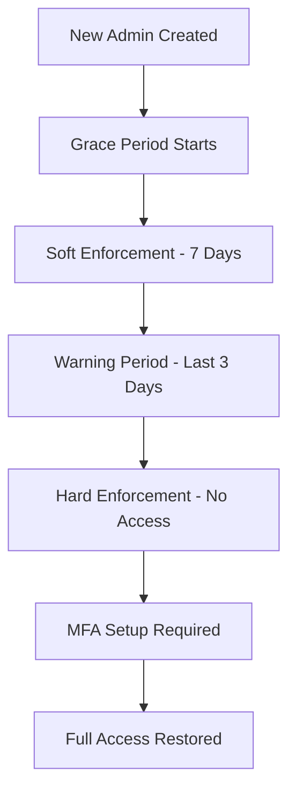
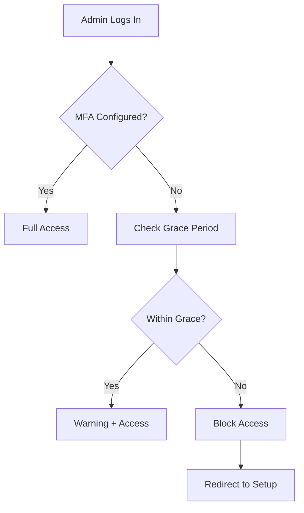

# MFA Enforcement System for Admin Users

## Overview

The Taxomind LMS now includes an automated Multi-Factor Authentication (MFA) enforcement system specifically designed for admin users. This system ensures that all admin accounts are secured with MFA while providing a configurable grace period and progressive enforcement approach.

## Key Features

### 🛡️ **Automated Enforcement**
- Automatic detection of admin users without MFA
- Progressive enforcement levels (soft → warning → hard)
- Configurable grace periods for new admin accounts
- Real-time access control via middleware

### 📱 **User Experience**
- Intuitive MFA setup wizard with QR code generation
- Clear status indicators and progress tracking
- Warning notifications before enforcement
- Backup recovery codes for emergencies

### 🔧 **Administrative Control**
- Environment-based configuration
- Detailed audit logging and analytics
- Notification system with email alerts
- Dashboard integration with status overview

### 🚀 **Enterprise Features**
- Compliance reporting and statistics
- Flexible enforcement policies
- Audit trail for security compliance
- Integration with existing authentication system

## Architecture Components

### Core Files

```
lib/auth/mfa-enforcement.ts         # Core enforcement logic
lib/auth/mfa-notifications.ts       # Notification system
middleware.ts                       # Route protection
auth.ts                            # Sign-in enforcement
app/admin/mfa-setup/               # Setup wizard pages
app/api/admin/mfa-status/          # Status API endpoint
```

### Database Integration

The system leverages existing database models:
- `User.totpEnabled`, `User.totpVerified`, `User.isTwoFactorEnabled`
- `User.totpSecret`, `User.recoveryCodes` (encrypted)
- `Notification` table for user alerts
- `AuthAudit` table for compliance logging

## Configuration

### Environment Variables

Add these to your `.env` file:

```bash
# Enable/disable MFA enforcement (default: true)
ADMIN_MFA_ENFORCEMENT_ENABLED=true

# Grace period in days for new admin accounts (default: 7)
ADMIN_MFA_GRACE_PERIOD_DAYS=7

# Warning period in days before enforcement (default: 3)
ADMIN_MFA_WARNING_PERIOD_DAYS=3

# Require MFA immediately for new admin accounts (default: false)
ADMIN_MFA_IMMEDIATE_ENFORCEMENT=false
```

### Enforcement Levels

| Level | Description | User Experience |
|-------|-------------|-----------------|
| **None** | MFA properly configured | ✅ Full access, success indicators |
| **Soft** | Grace period active | 💡 Recommendations, full access |
| **Warning** | Warning period active | ⚠️ Prominent warnings, full access |
| **Hard** | Grace period expired | 🚫 Access blocked until MFA setup |

## Implementation Details

### 1. Middleware Protection

The middleware (`middleware.ts`) automatically:
- Detects admin users on protected routes
- Checks MFA enforcement status
- Redirects to setup/warning pages when needed
- Allows access to MFA-related routes during setup

```typescript
// Middleware checks admin MFA status on every request
if (isLoggedIn && userRole === "ADMIN") {
  const mfaCheck = await shouldBlockAdminAccess(userId, pathname);
  if (mfaCheck.shouldBlock) {
    // Redirect to MFA setup
  }
}
```

### 2. Sign-in Enforcement

The authentication system (`auth.ts`) prevents sign-in for admins under hard enforcement:

```typescript
// Check MFA enforcement during sign-in
if (existingUser.role === "ADMIN") {
  const mfaEnforcement = shouldEnforceMFAOnSignIn(existingUser);
  if (mfaEnforcement.enforce) {
    return false; // Block sign-in
  }
}
```

### 3. Dashboard Integration

The admin dashboard displays MFA status prominently with:
- Color-coded status alerts
- Progress indicators for grace periods  
- Direct action buttons for setup
- Dismissible warnings for non-critical states

### 4. Setup Wizard

The MFA setup process (`/admin/mfa-setup`) includes:
- **Step 1**: Status overview and explanation
- **Step 2**: QR code generation and backup codes
- **Step 3**: Token verification
- **Step 4**: Completion confirmation

### 5. Notification System

Automated notifications are sent for:
- Grace period start (new admins)
- Warning period activation
- Imminent enforcement
- Access blocked alerts

## Security Features

### 🔐 **Encryption**
- TOTP secrets encrypted with master key
- Recovery codes securely stored
- Audit logs for all MFA actions

### 📊 **Monitoring**
- Real-time enforcement statistics
- Failed attempt tracking
- Compliance reporting

### 🎯 **Flexible Policies**
- Environment-specific configuration
- Grace period customization
- Emergency override capabilities

## User Flows

### New Admin Account Creation



### Existing Admin Without MFA



## API Endpoints

### GET `/api/admin/mfa-status`
Returns MFA enforcement status for the current admin user.

**Response:**
```json
{
  "success": true,
  "mfaInfo": {
    "userId": "user_123",
    "isTwoFactorEnabled": false,
    "totpEnabled": false,
    "totpVerified": false,
    "mfaEnforcementStatus": {
      "enforcementLevel": "warning",
      "daysUntilEnforcement": 2,
      "canAccessAdminRoutes": true,
      "message": "MFA setup required in 2 days"
    }
  }
}
```

## Routes

| Route | Purpose | Access |
|-------|---------|--------|
| `/admin/mfa-setup` | MFA configuration wizard | Admins without MFA |
| `/admin/mfa-warning` | Warning page with information | Admins in warning period |
| `/api/admin/mfa-status` | Get MFA status | Authenticated admins |

## Deployment Considerations

### Production Deployment

1. **Environment Configuration**: Set appropriate enforcement settings
2. **Database Migration**: Ensure TOTP fields are available  
3. **Encryption Key**: Generate secure `ENCRYPTION_MASTER_KEY`
4. **Email Service**: Configure notification email provider
5. **Monitoring**: Set up audit log monitoring

### Staging Environment

- Test with longer grace periods
- Verify notification system
- Check enforcement flows
- Validate admin experience

### Development Environment

- Use permissive settings for testing
- Enable detailed logging
- Test edge cases and error scenarios

## Monitoring & Analytics

### Enforcement Statistics

```typescript
const stats = await getMFAEnforcementStats();
// Returns: totalAdmins, adminsWithMFA, adminsInGracePeriod, etc.
```

### Audit Events

All MFA enforcement actions are logged:
- `MFA_BLOCKED_ACCESS`: Access denied due to missing MFA
- `MFA_FORCED_SETUP`: Sign-in blocked for enforcement
- `MFA_WARNING_SHOWN`: Warning displayed to user
- `MFA_GRACE_PERIOD_STARTED`: New admin grace period

### Compliance Reporting

Generate reports showing:
- Admin MFA adoption rates
- Enforcement timeline compliance
- Security incident summaries
- Policy effectiveness metrics

## Troubleshooting

### Common Issues

**Q: Admin locked out after enforcement activation?**
A: Temporarily set `ADMIN_MFA_ENFORCEMENT_ENABLED=false` to allow access, then guide through MFA setup.

**Q: Grace period not working?**
A: Check `ADMIN_MFA_GRACE_PERIOD_DAYS` setting and user creation date in database.

**Q: Notifications not appearing?**
A: Verify notification system database tables and check user notification preferences.

**Q: QR code not generating?**
A: Ensure `ENCRYPTION_MASTER_KEY` is properly set (64 hex characters).

### Debug Mode

Enable detailed logging:
```bash
NODE_ENV=development
```

This will log all MFA enforcement decisions and actions.

### Emergency Override

For emergency access, administrators can:
1. Set `ADMIN_MFA_ENFORCEMENT_ENABLED=false`
2. Restart the application
3. Allow admin to set up MFA
4. Re-enable enforcement

## Best Practices

### 🏢 **Organizational**
- Communicate MFA requirement before implementation
- Provide training on authenticator app usage
- Establish emergency access procedures
- Regular security awareness updates

### 🔧 **Technical**
- Monitor enforcement statistics regularly
- Keep backup access methods secure
- Test emergency override procedures
- Update documentation as policies evolve

### 📋 **Compliance**
- Document enforcement policy decisions
- Regular audit of MFA adoption
- Incident response for security events
- Compliance reporting for stakeholders

## Support & Maintenance

### Regular Tasks

- **Weekly**: Review enforcement statistics
- **Monthly**: Audit admin MFA adoption
- **Quarterly**: Review and update policies
- **Annually**: Security assessment and updates

### Monitoring Alerts

Set up monitoring for:
- High number of blocked access attempts
- Admins approaching enforcement deadline
- Failed MFA setup attempts
- System errors in enforcement logic

## Migration Guide

### Existing Installations

1. **Backup Database**: Ensure all user data is backed up
2. **Deploy Code**: Update to include MFA enforcement system
3. **Configure Environment**: Set appropriate grace periods
4. **Communicate**: Notify existing admins about new requirements
5. **Monitor**: Watch for issues during rollout period
6. **Support**: Be ready to assist admins with setup

### Rollback Procedure

If issues arise:
1. Set `ADMIN_MFA_ENFORCEMENT_ENABLED=false`
2. Restart application
3. Investigate and resolve issues
4. Re-enable with fixes deployed

---

**Implementation Date**: January 2025
**Version**: 1.0.0
**Last Updated**: January 2025

For technical support or questions about MFA enforcement, please refer to the system logs or contact the development team.