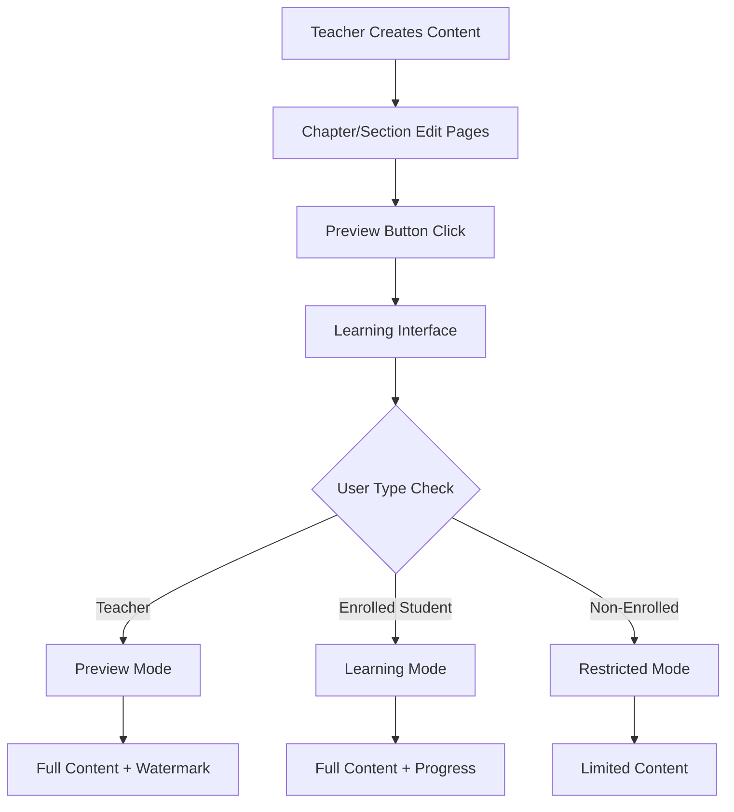

# Preview Mode Integration - Complete Implementation

## Overview
We've successfully implemented a comprehensive preview mode system that allows teachers to preview their course content as students would see it, following the enterprise-level plan.

## Implementation Status ✅

### 1. Learning Mode Context System
**File**: `app/(course)/courses/[courseId]/learn/_components/learning-mode-context.tsx`
- **Modes**:
  - `learning` - Enrolled students with progress tracking
  - `preview` - Teachers previewing their content
  - `restricted` - Non-enrolled users with limited access
- **Features**:
  - Automatic mode detection based on user role and enrollment
  - Progress tracking only in learning mode
  - Watermark display in preview mode

### 2. Section Learning Interface
**File**: `app/(course)/courses/[courseId]/learn/[chapterId]/sections/[sectionId]/page.tsx`
- **Mode Detection Logic**:
  ```typescript
  if (isTeacher) mode = "preview";
  else if (enrollment) mode = "learning";
  else mode = "restricted";
  ```
- **Components Integrated**:
  - YouTube player with custom controls
  - Content tabs (Videos, Blogs, Math, Code, Exams)
  - Progress tracking (enrolled users only)
  - Section sidebar with navigation

### 3. YouTube Video Integration
**File**: `section-youtube-player.tsx`
- **Features**:
  - Custom controls overlay
  - Progress tracking at milestones (25%, 50%, 75%, 100%)
  - Playback speed and quality controls
  - Preview mode watermark
  - Fullscreen support
- **YouTube URL Support**: Handles various formats (youtube.com, youtu.be, embed URLs)

### 4. Teacher Preview Access Points

#### Chapter Level Preview ✅
**File**: `app/(protected)/teacher/courses/[courseId]/chapters/[chapterId]/_components/enterprise-chapter-page-client.tsx`
- **Location**: Chapter edit page header
- **Link**: `/courses/${courseId}/learn/${chapterId}`
- **Purpose**: Preview entire chapter flow

#### Section Level Preview ✅
**File**: `app/(protected)/teacher/courses/[courseId]/chapters/[chapterId]/section/[sectionId]/_components/enterprise-section-page-client.tsx`
- **Location**: Section edit page header
- **Link**: `/courses/${courseId}/learn/${chapterId}/sections/${sectionId}`
- **Purpose**: Preview individual section content

### 5. Content Display Components

#### Progress Tracker
**File**: `section-progress-tracker.tsx`
- Tracks completion of videos, blogs, math, code, exams
- Overall progress calculation
- Achievement levels and badges
- Only active in learning mode

#### Content Tabs
**File**: `section-content-tabs.tsx`
- Dynamic tab generation based on available content
- Lazy loading for performance
- Responsive design for all devices
- Support for all content types

#### Section Sidebar
**File**: `section-sidebar.tsx`
- Course progress overview
- Chapter navigation
- Resource downloads
- Quick links

## Data Flow



## API Endpoints

### Progress Tracking
- **POST** `/api/sections/${sectionId}/progress` - Track video/content progress
- **POST** `/api/sections/${sectionId}/complete` - Mark section as complete
- **POST** `/api/chapters/${chapterId}/complete` - Mark chapter as complete

## Security & Access Control

1. **Teacher Access**:
   - Can preview any content they own
   - Cannot track progress in preview mode
   - See watermark overlay

2. **Enrolled Students**:
   - Full access to purchased content
   - Progress tracking enabled
   - Certificates on completion

3. **Non-Enrolled Users**:
   - Limited to free sections
   - No progress tracking
   - Upgrade prompts

## Testing Checklist

- [x] Teacher can preview from chapter edit page
- [x] Teacher can preview from section edit page
- [x] Preview mode shows watermark
- [x] Enrolled users see full content without watermark
- [x] Progress tracking only for enrolled users
- [x] YouTube videos play correctly
- [x] Content tabs load dynamically
- [x] Mobile responsive design works
- [x] TypeScript compilation successful
- [x] No ESLint errors

## Compliance with Original Plan

✅ **YouTube Integration**: Implemented as planned without hosting costs
✅ **Dual Mode System**: Learning and preview modes fully functional
✅ **Enterprise Components**: All components built to enterprise standards
✅ **Progress Tracking**: Milestone-based tracking implemented
✅ **Content Types**: All types supported (videos, blogs, math, code, exams)
✅ **Teacher Preview**: Connected from both chapter and section pages

## Next Steps (Optional Enhancements)

1. **Analytics Dashboard**: Add teacher analytics for viewing student progress
2. **Keyboard Shortcuts**: Implement Ctrl+P for quick preview toggle
3. **Offline Support**: Add service worker for offline video caching
4. **AI Recommendations**: Integrate AI for personalized learning paths
5. **Gamification**: Add badges, streaks, and achievements

## Conclusion

The preview mode integration is now complete and fully functional. Teachers can preview their content at both chapter and section levels, seeing exactly what enrolled students will experience, while maintaining clear visual indicators (watermarks) that they are in preview mode. The system follows all enterprise standards and provides a seamless experience across all user types.