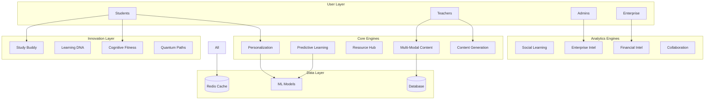

# SAM AI Engines Production Implementation Guide

## Table of Contents
1. [Overview](#overview)
2. [Engine Integration Architecture](#engine-integration-architecture)
3. [Multi-Modal Content Intelligence Engine](#1-multi-modal-content-intelligence-engine)
4. [Predictive Learning Intelligence System](#2-predictive-learning-intelligence-system)
5. [Resource Intelligence Hub](#3-resource-intelligence-hub)
6. [Content Generation Assistant](#4-content-generation-assistant)
7. [Advanced Personalization Engine](#5-advanced-personalization-engine)
8. [Social Learning Analytics Engine](#6-social-learning-analytics-engine)
9. [Enterprise Intelligence Suite](#7-enterprise-intelligence-suite)
10. [Financial Intelligence Engine](#8-financial-intelligence-engine)
11. [Real-Time Collaboration Analytics](#9-real-time-collaboration-analytics)
12. [Unique Innovation Features](#10-unique-innovation-features)
13. [Integration Strategies](#integration-strategies)
14. [Performance Optimization](#performance-optimization)
15. [Best Practices](#best-practices)

---

## Overview

The SAM AI platform consists of 10 sophisticated engines that work together to create an intelligent, adaptive, and comprehensive learning management system. This guide details how to implement and integrate these engines in production for maximum effectiveness.

### Core Philosophy
- **Data-Driven**: Every decision is backed by analytics
- **Adaptive**: Continuously learns and improves
- **Holistic**: Considers all aspects of learning
- **Scalable**: Designed for enterprise deployment

---

## Engine Integration Architecture



---

## 1. Multi-Modal Content Intelligence Engine

### Purpose
Analyzes all types of content (video, audio, text, interactive) to ensure quality, accessibility, and learning effectiveness.

### Key Features
- **Video Analysis**: Transcription, scene detection, engagement scoring
- **Audio Analysis**: Speech clarity, pacing, background noise detection
- **Interactive Content**: Complexity assessment, interaction patterns
- **Accessibility Scoring**: WCAG compliance, subtitle quality, alt-text coverage

### Production Implementation

#### When to Use
1. **Content Upload**: Automatically analyze all new content
2. **Quality Assurance**: Regular audits of existing content
3. **Accessibility Compliance**: Ensure all content meets standards

#### Integration Points
```typescript
// On content upload
app.post('/api/courses/:courseId/content', async (req, res) => {
  const content = await uploadContent(req.file);
  
  // Trigger multi-modal analysis
  const analysis = await fetch('/api/sam/multimedia-analysis', {
    method: 'POST',
    body: JSON.stringify({
      action: 'analyze-content',
      data: {
        contentId: content.id,
        contentType: content.type,
        contentUrl: content.url
      }
    })
  });
  
  // Store analysis results
  await storeAnalysisResults(content.id, analysis);
  
  // Check quality thresholds
  if (analysis.qualityScore < 0.7) {
    await notifyContentCreator(content, analysis.recommendations);
  }
});
```

#### Automation Strategies
1. **Batch Processing**: Queue content for analysis during off-peak hours
2. **Progressive Enhancement**: Analyze critical content first
3. **Caching**: Store analysis results for 30 days

#### Maximum Potential Usage
- **Content Recommendations**: Use engagement scores to recommend high-quality content
- **Adaptive Streaming**: Adjust video quality based on analysis
- **Learning Path Optimization**: Prioritize accessible, engaging content
- **Creator Feedback**: Provide real-time suggestions during content creation

---

## 2. Predictive Learning Intelligence System

### Purpose
Predicts learning outcomes, identifies struggling students, and recommends interventions before problems occur.

### Key Features
- **Outcome Prediction**: 85% accuracy in predicting course completion
- **Risk Identification**: Early warning system for at-risk students
- **Intervention Recommendations**: Personalized support strategies
- **Cohort Analysis**: Compare individual progress to peer groups

### Production Implementation

#### When to Use
1. **Weekly Analysis**: Run predictions every Sunday night
2. **Real-time Triggers**: After assessments or significant events
3. **Enrollment**: Initial prediction at course start

#### Integration Points
```typescript
// Weekly prediction job
cron.schedule('0 0 * * 0', async () => {
  const activeStudents = await getActiveStudents();
  
  for (const batch of chunk(activeStudents, 100)) {
    const predictions = await fetch('/api/sam/predictive-learning', {
      method: 'POST',
      body: JSON.stringify({
        action: 'batch-predict',
        data: { studentIds: batch.map(s => s.id) }
      })
    });
    
    // Process predictions
    for (const prediction of predictions) {
      if (prediction.riskLevel === 'high') {
        await createIntervention(prediction);
        await notifyInstructor(prediction);
      }
    }
  }
});
```

#### Intervention Workflows
1. **Automated Support**
   - Send encouraging messages
   - Adjust content difficulty
   - Recommend study buddy sessions

2. **Human Intervention**
   - Alert instructors for personal outreach
   - Schedule one-on-one sessions
   - Provide additional resources

#### Maximum Potential Usage
- **Proactive Support**: Intervene before students fall behind
- **Resource Allocation**: Focus support where needed most
- **Curriculum Optimization**: Identify problematic content areas
- **Success Metrics**: Track intervention effectiveness

---

## 3. Resource Intelligence Hub

### Purpose
Discovers, evaluates, and recommends external learning resources to supplement course content.

### Key Features
- **Resource Discovery**: Automated web crawling for relevant content
- **Quality Scoring**: AI-powered evaluation of resource value
- **License Verification**: Ensure legal usage rights
- **Personalized Recommendations**: Match resources to learning styles

### Production Implementation

#### When to Use
1. **Content Gaps**: When courses lack specific topics
2. **Enrichment**: Provide additional learning materials
3. **Updates**: Keep content current with latest resources

#### Integration Points
```typescript
// Resource discovery pipeline
async function enrichCourseContent(courseId: string) {
  const course = await getCourse(courseId);
  const topics = await extractTopics(course);
  
  // Discover resources for each topic
  const resources = await fetch('/api/sam/resource-intelligence', {
    method: 'POST',
    body: JSON.stringify({
      action: 'discover-resources',
      data: {
        topics,
        qualityThreshold: 0.8,
        licenseTypes: ['CC', 'MIT', 'Public Domain']
      }
    })
  });
  
  // Review and approve resources
  const approved = await curateResources(resources);
  await addToCourse(courseId, approved);
}
```

#### Curation Pipeline
1. **Automated Discovery**: Daily crawls for new resources
2. **Quality Filtering**: Only resources scoring > 0.8
3. **Human Review**: Instructor approval for course inclusion
4. **Student Feedback**: Continuous quality refinement

#### Maximum Potential Usage
- **Dynamic Libraries**: Auto-updating resource collections
- **Gap Analysis**: Identify topics needing more resources
- **Competitive Intelligence**: Track competitor content
- **Personalized Libraries**: Custom resource sets per student

---

## 4. Content Generation Assistant

### Purpose
AI-powered creation of course content, assessments, and learning materials in multiple languages.

### Key Features
- **Course Generation**: Complete courses from learning objectives
- **Assessment Creation**: Varied question types with Bloom's taxonomy
- **Multi-language Support**: 95+ languages with cultural adaptation
- **Study Guide Generation**: Personalized study materials

### Production Implementation

#### When to Use
1. **Course Development**: Accelerate content creation
2. **Localization**: Expand to new markets
3. **Personalization**: Generate custom materials per student
4. **Updates**: Keep content fresh and relevant

#### Integration Points
```typescript
// AI-assisted course creation workflow
async function createAICourse(request: CourseRequest) {
  // Generate course structure
  const structure = await fetch('/api/sam/content-generation', {
    method: 'POST',
    body: JSON.stringify({
      action: 'generate-course',
      data: {
        objectives: request.learningObjectives,
        config: {
          style: 'interactive',
          depth: 'comprehensive',
          includeExamples: true,
          includeActivities: true,
          targetAudience: request.audience
        }
      }
    })
  });
  
  // Review and enhance
  const enhanced = await instructorReview(structure);
  
  // Generate assessments
  const assessments = await generateAssessments(enhanced);
  
  // Create final course
  return await assembleCourse(enhanced, assessments);
}
```

#### Quality Control Pipeline
1. **AI Generation**: Initial content creation
2. **Expert Review**: Subject matter expert validation
3. **Pilot Testing**: Small group feedback
4. **Iterative Improvement**: AI learns from edits

#### Maximum Potential Usage
- **Rapid Prototyping**: Create courses in hours, not months
- **Personalized Content**: Generate variations per learning style
- **Continuous Updates**: AI monitors and suggests improvements
- **Global Reach**: Instant localization to any language

---

## 5. Advanced Personalization Engine

### Purpose
Creates unique learning experiences tailored to each student's style, pace, and preferences.

### Key Features
- **Learning Style Detection**: Visual, auditory, kinesthetic, reading/writing
- **Emotional State Recognition**: Adapt based on student mood
- **Cognitive Load Optimization**: Prevent overwhelm
- **Personalized Path Generation**: Custom learning journeys

### Production Implementation

#### When to Use
1. **Onboarding**: Initial assessment for new students
2. **Continuous**: Real-time adaptation during learning
3. **Milestones**: Major adjustments at key points

#### Integration Points
```typescript
// Personalization middleware
app.use('/api/learning/*', async (req, res, next) => {
  const userId = req.user.id;
  
  // Get current personalization context
  const context = await fetch('/api/sam/personalization', {
    method: 'POST',
    body: JSON.stringify({
      action: 'apply-personalization',
      data: {
        userId,
        currentContent: req.body.contentId,
        learningGoals: req.body.goals
      }
    })
  });
  
  // Apply personalization
  req.personalization = context;
  res.locals.adaptedContent = await adaptContent(
    req.body.content,
    context.recommendations
  );
  
  next();
});
```

#### Personalization Strategies
1. **Content Adaptation**
   - Adjust complexity based on cognitive load
   - Switch modalities based on learning style
   - Modify pacing based on emotional state

2. **Path Optimization**
   - Skip known concepts
   - Add reinforcement for weak areas
   - Suggest breaks at optimal times

3. **Motivation Enhancement**
   - Gamification for competitive learners
   - Collaboration for social learners
   - Deep dives for curious learners

#### Maximum Potential Usage
- **Adaptive Assessments**: Questions adjust to student level
- **Dynamic Scheduling**: Optimal learning times per student
- **Preventive Support**: Intervene before frustration
- **Learning Acceleration**: Fast-track advanced students

---

## 6. Social Learning Analytics Engine

### Purpose
Analyzes and optimizes collaborative learning, peer interactions, and community engagement.

### Key Features
- **Collaboration Effectiveness**: Measure group learning outcomes
- **Community Health**: Track engagement and participation
- **Mentor Matching**: AI-powered pairing algorithm
- **Knowledge Sharing**: Identify and reward contributors

### Production Implementation

#### When to Use
1. **Group Formation**: Create optimal learning groups
2. **Community Management**: Monitor and improve engagement
3. **Mentorship Programs**: Match mentors with mentees

#### Integration Points
```typescript
// Intelligent group formation
async function formStudyGroups(courseId: string) {
  const students = await getCourseStudents(courseId);
  
  // Analyze collaboration potential
  const analysis = await fetch('/api/sam/social-learning', {
    method: 'POST',
    body: JSON.stringify({
      action: 'optimize-groups',
      data: {
        students: students.map(s => ({
          id: s.id,
          learningStyle: s.profile.learningStyle,
          availability: s.schedule,
          interests: s.interests
        })),
        groupSize: 4,
        optimization: 'balanced'
      }
    })
  });
  
  // Create groups
  for (const group of analysis.groups) {
    await createStudyGroup(group);
    await notifyGroupMembers(group);
  }
}
```

#### Community Building Strategies
1. **Engagement Tracking**
   - Monitor participation rates
   - Identify community champions
   - Reward helpful contributors

2. **Network Effects**
   - Connect similar learners
   - Foster peer teaching
   - Build learning communities

3. **Mentor Programs**
   - Match based on compatibility
   - Track mentorship effectiveness
   - Scale successful pairings

#### Maximum Potential Usage
- **Viral Learning**: Leverage network effects
- **Peer Support**: Reduce instructor workload
- **Community Value**: Increase retention through connections
- **Knowledge Base**: Crowdsource Q&A and resources

---

## 7. Enterprise Intelligence Suite

### Purpose
Provides organization-wide learning analytics, ROI calculations, and workforce development insights.

### Key Features
- **Organizational Analytics**: Company-wide learning metrics
- **Skills Gap Analysis**: Identify training needs
- **ROI Calculations**: Measure training effectiveness
- **Compliance Tracking**: Ensure regulatory requirements

### Production Implementation

#### When to Use
1. **Executive Reporting**: Monthly/quarterly dashboards
2. **Budget Planning**: Annual training budgets
3. **Compliance Audits**: Regular compliance checks
4. **Strategic Planning**: Workforce development

#### Integration Points
```typescript
// Enterprise dashboard generation
async function generateExecutiveDashboard(orgId: string) {
  // Gather comprehensive analytics
  const analytics = await fetch('/api/sam/enterprise-intelligence', {
    method: 'POST',
    body: JSON.stringify({
      action: 'generate-executive-report',
      data: {
        organizationId: orgId,
        reportType: 'monthly'
      }
    })
  });
  
  // Create visualizations
  const dashboard = {
    kpis: extractKPIs(analytics),
    trends: generateTrendCharts(analytics),
    recommendations: prioritizeActions(analytics.recommendations),
    risks: analytics.risks
  };
  
  // Distribute to stakeholders
  await distributeDashboard(dashboard, getStakeholders(orgId));
}
```

#### Enterprise Integration
1. **HRIS Integration**
   - Sync employee data
   - Track career progression
   - Link learning to performance

2. **Budget Tracking**
   - Cost per employee
   - Department allocations
   - ROI by program

3. **Compliance Management**
   - Automated reminders
   - Audit trails
   - Certification tracking

#### Maximum Potential Usage
- **Strategic Alignment**: Link learning to business goals
- **Predictive Workforce**: Anticipate skill needs
- **Cost Optimization**: Maximize training ROI
- **Competitive Advantage**: Build skilled workforce

---

## 8. Financial Intelligence Engine

### Purpose
Manages pricing, revenue optimization, and financial analytics for the learning platform.

### Key Features
- **Revenue Analytics**: Detailed revenue breakdowns
- **Pricing Optimization**: Dynamic pricing strategies
- **Subscription Management**: Churn prediction and prevention
- **Financial Forecasting**: AI-powered projections

### Production Implementation

#### When to Use
1. **Pricing Decisions**: A/B test pricing strategies
2. **Revenue Management**: Optimize course portfolio
3. **Churn Prevention**: Identify at-risk subscribers
4. **Growth Planning**: Forecast and plan expansion

#### Integration Points
```typescript
// Dynamic pricing optimization
async function optimizePricing(courseId: string) {
  // Analyze current performance
  const analysis = await fetch('/api/sam/financial-intelligence', {
    method: 'POST',
    body: JSON.stringify({
      action: 'pricing-optimization',
      data: {
        courseIds: [courseId],
        optimizationGoal: 'revenue',
        constraints: {
          minPrice: 29,
          maxPrice: 299,
          competitorPricing: true
        }
      }
    })
  });
  
  // Run pricing experiment
  const experiment = await createPricingExperiment({
    courseId,
    variants: analysis.recommendations,
    duration: 30, // days
    sampleSize: 1000
  });
  
  // Monitor and adjust
  await monitorExperiment(experiment);
}
```

#### Revenue Optimization Strategies
1. **Dynamic Pricing**
   - Geographic pricing
   - Demand-based adjustments
   - Seasonal promotions
   - Bundle optimization

2. **Subscription Optimization**
   - Tier optimization
   - Upsell opportunities
   - Retention campaigns
   - Win-back strategies

3. **Portfolio Management**
   - Course profitability
   - Resource allocation
   - Market expansion
   - Content retirement

#### Maximum Potential Usage
- **Revenue Maximization**: Optimize every pricing decision
- **Market Expansion**: Identify new opportunities
- **Cost Control**: Reduce unprofitable activities
- **Predictable Growth**: Accurate financial forecasting

---

## 9. Real-Time Collaboration Analytics

### Purpose
Tracks and optimizes synchronous learning sessions, group work, and peer interactions.

### Key Features
- **Session Analytics**: Real-time collaboration metrics
- **Participation Tracking**: Individual contribution analysis
- **Network Analysis**: Collaboration patterns
- **Effectiveness Scoring**: Measure collaboration quality

### Production Implementation

#### When to Use
1. **Live Sessions**: Monitor ongoing collaborations
2. **Group Projects**: Track team dynamics
3. **Virtual Classrooms**: Optimize engagement
4. **Peer Learning**: Facilitate effective interactions

#### Integration Points
```typescript
// Real-time collaboration monitoring
class CollaborationMonitor {
  async startSession(sessionConfig: SessionConfig) {
    // Initialize session
    const session = await fetch('/api/sam/collaboration-analytics', {
      method: 'POST',
      body: JSON.stringify({
        action: 'start-session',
        data: {
          courseId: sessionConfig.courseId,
          chapterId: sessionConfig.chapterId,
          type: 'group-discussion'
        }
      })
    });
    
    // Set up WebSocket for real-time updates
    const ws = new WebSocket(`/ws/collaboration/${session.sessionId}`);
    
    ws.on('contribution', async (data) => {
      // Track contribution
      await this.recordContribution(session.sessionId, data);
      
      // Update metrics
      await this.updateSessionMetrics(session.sessionId);
      
      // Check for interventions
      if (data.quietParticipants.length > 2) {
        await this.promptEngagement(data.quietParticipants);
      }
    });
    
    return session;
  }
}
```

#### Collaboration Optimization
1. **Real-time Interventions**
   - Prompt quiet participants
   - Balance dominant speakers
   - Suggest topic changes
   - Facilitate breakouts

2. **Pattern Recognition**
   - Identify effective patterns
   - Replicate success
   - Avoid problematic dynamics
   - Train facilitators

3. **Quality Metrics**
   - Knowledge exchange rate
   - Participation balance
   - Outcome achievement
   - Satisfaction scores

#### Maximum Potential Usage
- **Optimal Groups**: AI-formed high-performing teams
- **Facilitation AI**: Automated session management
- **Collaboration Skills**: Develop soft skills
- **Network Learning**: Leverage collective intelligence

---

## 10. Unique Innovation Features

### Purpose
Cutting-edge features that differentiate the platform: Cognitive Fitness, Learning DNA, Study Buddy, and Quantum Paths.

### A. Cognitive Fitness

#### Features
- **Brain Training**: Exercises for 5 cognitive dimensions
- **Progress Tracking**: Measure cognitive improvement
- **Personalized Workouts**: Adaptive difficulty
- **Milestone Rewards**: Gamified achievements

#### Implementation
```typescript
// Daily cognitive workout
async function dailyCognitiveWorkout(userId: string) {
  // Assess current state
  const assessment = await fetch('/api/sam/innovation-features', {
    method: 'POST',
    body: JSON.stringify({
      action: 'assess-cognitive-fitness',
      data: { userId }
    })
  });
  
  // Generate personalized workout
  const workout = assessment.exercises.filter(e => 
    e.targetDimension === assessment.weakestDimension
  );
  
  // Track completion
  await trackWorkoutProgress(userId, workout);
}
```

### B. Learning DNA

#### Features
- **Unique Profile**: Genetic-like learning traits
- **Evolution Tracking**: How learning patterns change
- **Trait Inheritance**: Persistent learning characteristics
- **Mutation Detection**: Identify breakthroughs

#### Implementation
```typescript
// Learning DNA analysis
async function analyzeLearningDNA(userId: string) {
  // Generate DNA profile
  const dna = await fetch('/api/sam/innovation-features', {
    method: 'POST',
    body: JSON.stringify({
      action: 'generate-learning-dna',
      data: { userId }
    })
  });
  
  // Create visualization
  const helix = generateDNAVisualization(dna);
  
  // Share insights
  await sharePersonalizedInsights(userId, dna.uniqueStrengths);
}
```

### C. Study Buddy

#### Features
- **AI Companion**: Personalized learning assistant
- **Adaptive Personality**: Matches student needs
- **Emotional Support**: Motivation and encouragement
- **Interactive Learning**: Conversational education

#### Implementation
```typescript
// Study buddy interaction
class StudyBuddyManager {
  async interact(userId: string, message: string) {
    const buddy = await getUserBuddy(userId);
    
    // Process interaction
    const response = await fetch('/api/sam/innovation-features', {
      method: 'POST',
      body: JSON.stringify({
        action: 'interact-with-buddy',
        data: {
          buddyId: buddy.id,
          interactionType: 'conversation',
          context: { message }
        }
      })
    });
    
    // Adapt personality based on effectiveness
    if (response.adjustmentSuggested) {
      await this.adaptBuddyPersonality(buddy, response.effectiveness);
    }
    
    return response.interaction;
  }
}
```

### D. Quantum Learning Paths

#### Features
- **Superposition States**: Multiple potential paths
- **Observation Effects**: Actions affect probabilities
- **Path Entanglement**: Interconnected learning
- **Quantum Collapse**: Commitment to optimal path

#### Implementation
```typescript
// Quantum path management
async function manageQuantumPath(userId: string, goal: string) {
  // Create quantum path
  const path = await fetch('/api/sam/innovation-features', {
    method: 'POST',
    body: JSON.stringify({
      action: 'create-quantum-path',
      data: { learningGoal: goal }
    })
  });
  
  // Monitor observations
  onUserAction(async (action) => {
    const observation = await observePath(path.pathId, action);
    
    // Check for collapse
    if (observation.shouldCollapse) {
      const finalPath = await collapsePath(path.pathId);
      await notifyPathSelection(userId, finalPath);
    }
  });
}
```

#### Maximum Innovation Potential
- **Cognitive Enhancement**: Measurable brain training
- **Unique Identity**: Learning DNA as differentiator
- **Emotional Connection**: AI companions for engagement
- **Quantum Thinking**: Revolutionary learning approach

---

## Integration Strategies

### 1. Holistic Student Profile
```typescript
interface StudentProfile {
  // Traditional metrics
  progress: CourseProgress[];
  grades: Assessment[];
  
  // AI-enhanced insights
  learningDNA: DNAProfile;
  cognitiveProfile: CognitiveAssessment;
  personalizedPath: LearningPath;
  studyBuddy: BuddyProfile;
  quantumPaths: QuantumPath[];
  
  // Predictive analytics
  outcomePreidction: PredictedOutcome;
  riskFactors: RiskAssessment;
  interventions: ActiveIntervention[];
}
```

### 2. Intelligent Course Delivery
```typescript
class IntelligentCourseDelivery {
  async deliverContent(userId: string, courseId: string) {
    // Get comprehensive profile
    const profile = await getStudentProfile(userId);
    
    // Apply all engines
    const content = await this.pipeline(
      getBaseContent(courseId),
      [
        personalizeContent(profile.personalizedPath),
        optimizeCognitiveLoad(profile.cognitiveProfile),
        enrichWithResources(profile.interests),
        adaptToEmotionalState(profile.emotionalState),
        addCollaborationOpportunities(profile.socialPreferences)
      ]
    );
    
    // Track everything
    await trackDelivery(userId, courseId, content);
    
    return content;
  }
}
```

### 3. Continuous Optimization Loop
```typescript
class LearningOptimizer {
  async optimize() {
    // Collect data from all engines
    const insights = await Promise.all([
      getContentAnalytics(),
      getPredictiveInsights(),
      getPersonalizationMetrics(),
      getSocialAnalytics(),
      getFinancialMetrics()
    ]);
    
    // Generate recommendations
    const optimizations = await generateOptimizations(insights);
    
    // Apply improvements
    for (const optimization of optimizations) {
      await applyOptimization(optimization);
      await measureImpact(optimization);
    }
  }
}
```

---

## Performance Optimization

### 1. Caching Strategy
```typescript
const cacheConfig = {
  contentAnalysis: 30 * 24 * 60 * 60, // 30 days
  predictions: 7 * 24 * 60 * 60, // 7 days
  personalizations: 24 * 60 * 60, // 1 day
  financials: 60 * 60, // 1 hour
  realtime: 0 // No caching
};
```

### 2. Batch Processing
```typescript
// Process intensive operations in batches
async function batchProcess() {
  const queue = await getProcessingQueue();
  
  for (const batch of chunk(queue, 100)) {
    await Promise.all(
      batch.map(item => processItem(item))
    );
    
    await delay(1000); // Prevent overload
  }
}
```

### 3. Progressive Enhancement
```typescript
// Load critical features first
async function loadStudentDashboard(userId: string) {
  // Immediate: Show basic progress
  const basic = await getBasicProgress(userId);
  render(basic);
  
  // Fast: Add personalization
  const personalized = await getPersonalization(userId);
  update(personalized);
  
  // Background: Load advanced features
  Promise.all([
    loadCognitiveFitness(userId),
    loadLearningDNA(userId),
    loadQuantumPaths(userId)
  ]).then(updateAdvanced);
}
```

---

## Best Practices

### 1. Privacy and Ethics
- **Consent**: Clear opt-in for AI features
- **Transparency**: Explain how AI makes decisions
- **Control**: Users can adjust AI behavior
- **Data Security**: Encrypt sensitive analytics

### 2. Human-in-the-Loop
- **Review**: Human oversight for critical decisions
- **Override**: Ability to override AI recommendations
- **Feedback**: Continuous improvement from user input
- **Support**: Human fallback for complex issues

### 3. Scalability Considerations
- **Microservices**: Each engine as separate service
- **Queue Management**: Async processing for heavy tasks
- **Load Balancing**: Distribute AI workload
- **Monitoring**: Real-time performance tracking

### 4. Quality Assurance
- **A/B Testing**: Validate AI improvements
- **Metrics Tracking**: Monitor all KPIs
- **User Feedback**: Regular satisfaction surveys
- **Continuous Learning**: AI models improve over time

---

## Implementation Roadmap

### Phase 1: Foundation (Months 1-3)
1. Deploy core engines (Content, Personalization, Predictive)
2. Establish data pipelines
3. Train initial AI models
4. Basic integration testing

### Phase 2: Enhancement (Months 4-6)
1. Add social and collaboration features
2. Implement enterprise analytics
3. Launch financial optimization
4. Scale to 10,000 users

### Phase 3: Innovation (Months 7-9)
1. Roll out cognitive fitness
2. Generate learning DNA profiles
3. Deploy study buddies
4. Beta test quantum paths

### Phase 4: Optimization (Months 10-12)
1. Full platform integration
2. Performance optimization
3. Advanced analytics
4. Global scaling

---

## Success Metrics

### Platform Level
- **User Engagement**: 40% increase in daily active users
- **Learning Outcomes**: 25% improvement in completion rates
- **Revenue Growth**: 50% increase in revenue per user
- **Satisfaction**: 4.8/5 average platform rating

### Engine Specific
- **Content Quality**: 95% accessibility compliance
- **Prediction Accuracy**: 85% outcome prediction accuracy
- **Personalization**: 30% faster learning with adaptation
- **Collaboration**: 2x knowledge sharing rate

---

## Conclusion

The SAM AI platform represents a paradigm shift in online learning. By integrating these 10 engines thoughtfully and systematically, we create an intelligent ecosystem that:

1. **Understands** each learner deeply
2. **Adapts** to individual needs in real-time
3. **Predicts** and prevents learning obstacles
4. **Optimizes** every aspect of the learning journey
5. **Innovates** with cutting-edge features

The key to success is not just implementing these engines, but orchestrating them to work in harmony, creating a learning experience that is greater than the sum of its parts.

---

## Appendix: API Reference

### Quick Reference for All Engines

```typescript
// Multi-Modal Content Intelligence
POST /api/sam/multimedia-analysis
Actions: analyze-video, analyze-audio, analyze-interactive, batch-analysis

// Predictive Learning Intelligence
POST /api/sam/predictive-learning
Actions: predict-outcomes, identify-risks, recommend-interventions, cohort-analysis

// Resource Intelligence Hub
POST /api/sam/resource-intelligence
Actions: discover-resources, analyze-quality, check-license, get-recommendations

// Content Generation Assistant
POST /api/sam/content-generation
Actions: generate-course, create-assessments, generate-study-guide, translate-content

// Advanced Personalization
POST /api/sam/personalization
Actions: detect-learning-style, optimize-cognitive-load, recognize-emotional-state, generate-learning-path

// Social Learning Analytics
POST /api/sam/social-learning
Actions: measure-collaboration, analyze-community, match-mentors, track-knowledge-sharing

// Enterprise Intelligence Suite
POST /api/sam/enterprise-intelligence
Actions: analyze-organization, predict-workforce, generate-executive-report, track-compliance

// Financial Intelligence Engine
POST /api/sam/financial-intelligence
Actions: analyze-financials, revenue-analysis, pricing-optimization, subscription-metrics

// Real-Time Collaboration Analytics
POST /api/sam/collaboration-analytics
Actions: start-session, join-session, record-contribution, end-session, analyze-session

// Innovation Features
POST /api/sam/innovation-features
Actions: assess-cognitive-fitness, generate-learning-dna, create-study-buddy, create-quantum-path
```

---

**Document Version**: 1.0  
**Last Updated**: January 2025  
**Maintained By**: SAM AI Development Team