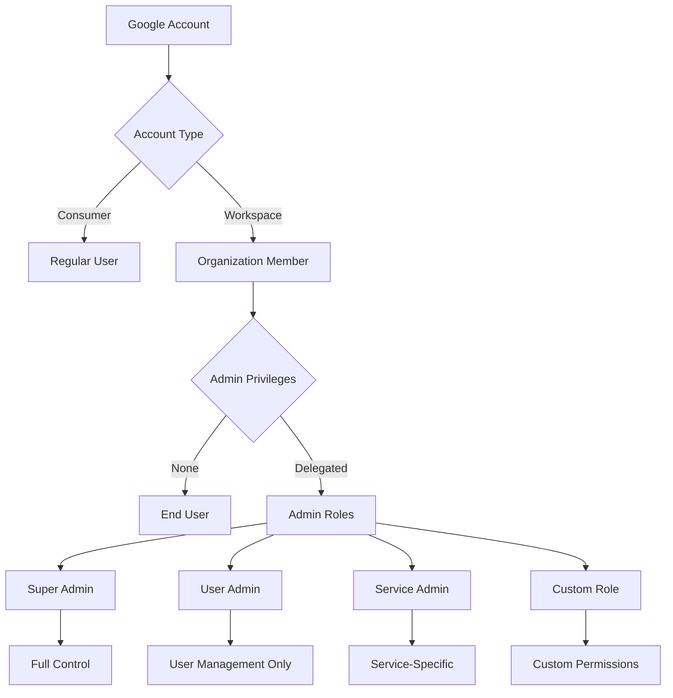
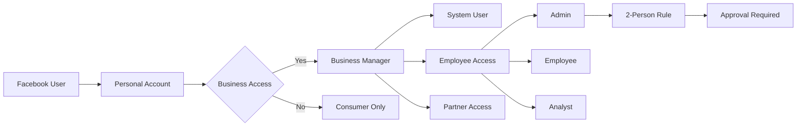
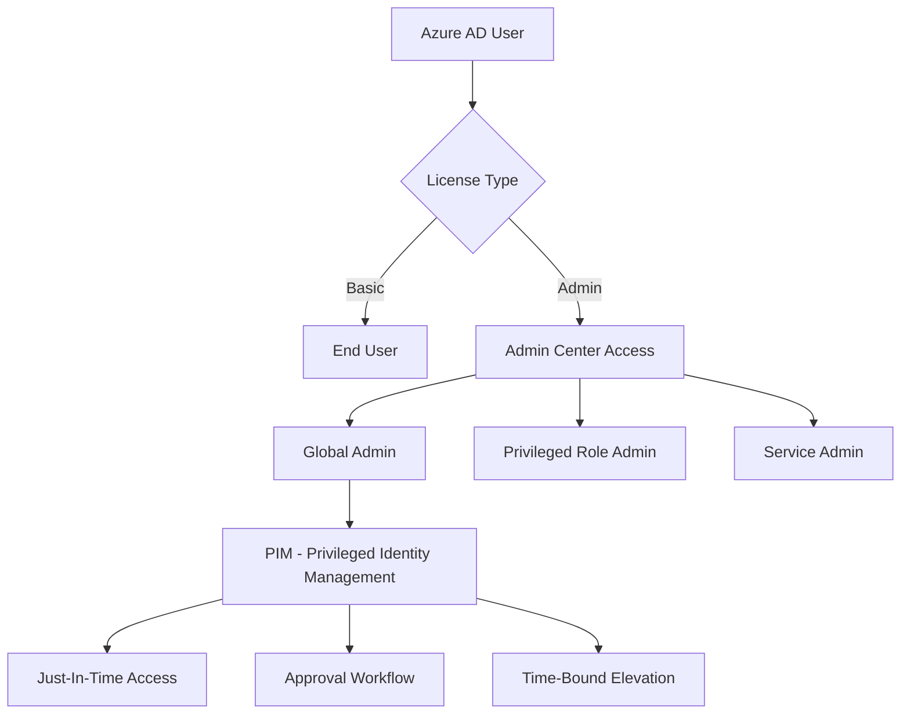
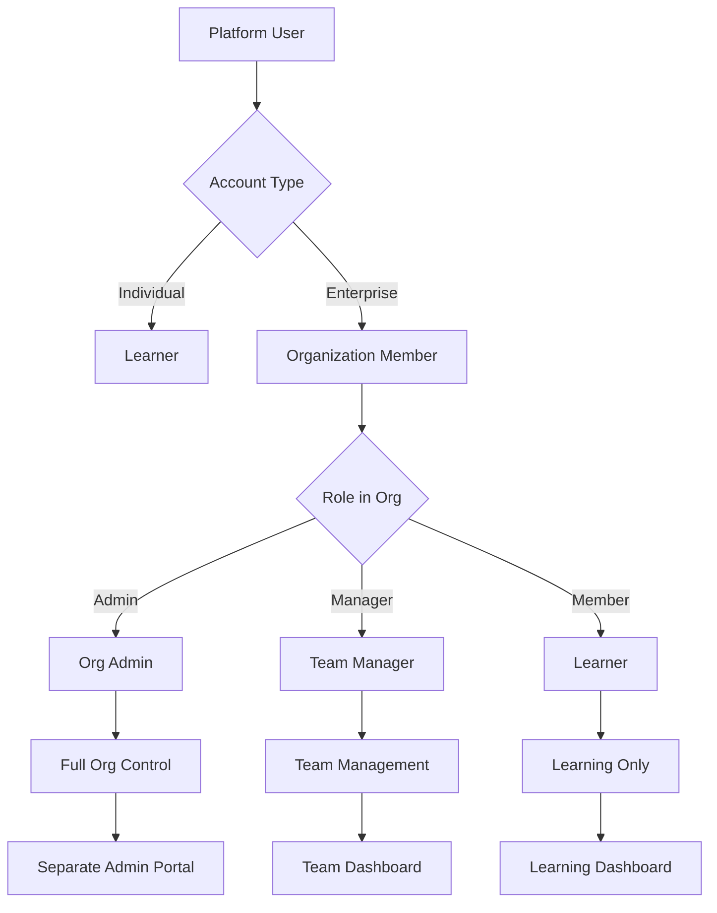

# 🔐 Admin vs User Role Separation Analysis

## How Enterprise Companies Separate Admin and User Roles

---

## 🏢 Enterprise Role Separation Models

### 1. **Google's Model: Workspace Admin Console**



**Key Features:**
- **Complete Separation**: Admin console is a separate application (admin.google.com)
- **Granular Roles**: 30+ predefined admin roles
- **Delegation**: Admins can delegate specific tasks without full access
- **Audit Everything**: Every admin action is logged with justification
- **Time-bound Access**: Temporary admin elevation for specific tasks

### 2. **Facebook/Meta's Model: Business Manager**



**Key Features:**
- **Business vs Personal**: Complete separation of business and personal contexts
- **2-Person Rule**: Critical actions require two admins
- **Asset-Based Permissions**: Admins for specific assets (Pages, Ad Accounts)
- **Access Requests**: Users request access, admins approve
- **Business Verification**: Business must be verified for admin features

### 3. **Microsoft Azure/Office 365 Model**



**Key Features:**
- **Privileged Identity Management (PIM)**: Just-in-time admin access
- **Conditional Access**: Admin access only from secure devices/locations
- **Break-Glass Accounts**: Emergency admin accounts with alerts
- **Admin Units**: Scope admin permissions to specific organizational units

### 4. **Coursera/Udemy Enterprise Model**



**Key Features:**
- **Organization Context**: Admins exist only within organization context
- **Separate Portals**: Different URLs/apps for admin vs learning
- **Bulk Operations**: Admin-specific bulk user management
- **Analytics Access**: Admins see organization-wide analytics
- **Contract Management**: Only admins can manage enterprise contracts

---

## 🔍 Current Taxomind Implementation Analysis

### What You Have ✅

#### 1. **Basic Role Separation**
```typescript
// Prisma Schema
enum UserRole {
  ADMIN
  USER
}
```
- Two distinct roles in database
- Role stored in JWT session
- Role-based middleware routing

#### 2. **Route Protection**
```typescript
// middleware.ts
const ADMIN_ONLY_ROUTES = [
  '/admin',
  '/dashboard/admin',
  '/admin/users',
  '/admin/settings',
  '/admin/audit',
];

// Proper access control
if (userRole === "ADMIN") {
  // Allow all routes
} else {
  // Check capability-based access
}
```

#### 3. **Separate Dashboards**
- `/dashboard/admin` - Admin dashboard
- `/dashboard` - User dashboard with context switching
- Different UI/UX for each role

#### 4. **Admin Guards**
```typescript
// AdminGuard component
if (session.user.role !== UserRole.ADMIN) {
  redirect("/unauthorized");
}
```

#### 5. **MFA Enforcement for Admins**
- Admins required to set up MFA
- Grace period implementation
- Separate MFA flow for admins

#### 6. **Admin Creation Strategies**
- First user becomes admin
- Environment variable whitelist
- CLI command promotion
- Invitation system

### What You're Missing ❌

#### 1. **No Separate Admin Application**
- **Current**: Same app, different routes
- **Enterprise**: Completely separate admin portal (admin.taxomind.com)

#### 2. **No Granular Admin Roles**
- **Current**: Single ADMIN role
- **Enterprise**: Multiple admin types (Super Admin, User Admin, Content Admin, Support Admin)

#### 3. **No Just-In-Time Admin Access**
- **Current**: Permanent admin status
- **Enterprise**: Temporary elevation with expiry

#### 4. **No Admin Action Justification**
- **Current**: Basic audit logs
- **Enterprise**: Require reason for sensitive actions

#### 5. **No Two-Person Authorization**
- **Current**: Single admin can do everything
- **Enterprise**: Critical actions need approval

#### 6. **No Admin Scope Limitation**
- **Current**: Admins have global access
- **Enterprise**: Admins scoped to specific resources/organizations

---

## 📊 Gap Analysis: Your Level vs Enterprise

| Feature | Taxomind Current | Enterprise Standard | Gap Level |
|---------|-----------------|-------------------|-----------|
| **Role Separation** | ✅ ADMIN/USER | Multiple granular roles | 🟡 Medium |
| **Route Protection** | ✅ Middleware-based | Separate applications | 🔴 High |
| **Admin Portal** | ❌ Same app | Separate subdomain/app | 🔴 High |
| **Admin Types** | ❌ Single admin | 10+ admin roles | 🔴 High |
| **Temporal Access** | ❌ Permanent | JIT with expiry | 🔴 High |
| **Approval Workflow** | ❌ None | Multi-person approval | 🟡 Medium |
| **Audit Trail** | ⚠️ Basic | Detailed with reasons | 🟡 Medium |
| **Admin Scoping** | ❌ Global only | Resource-based | 🔴 High |
| **Break-Glass** | ❌ None | Emergency accounts | 🟡 Medium |
| **Admin Training** | ❌ None | Required certification | 🟢 Low |

**Overall Score: 3/10** (Basic implementation, needs significant enhancement)

---

## 🚀 Implementation Plan: Reaching Enterprise Level

### Phase 1: Enhanced Role System (Week 1-2)

#### 1.1 Create Granular Admin Roles

```typescript
// lib/auth/admin-roles.ts
export enum AdminRole {
  SUPER_ADMIN = "SUPER_ADMIN",           // Full system control
  USER_ADMIN = "USER_ADMIN",             // User management only
  CONTENT_ADMIN = "CONTENT_ADMIN",       // Course/content management
  BILLING_ADMIN = "BILLING_ADMIN",       // Billing and subscriptions
  SUPPORT_ADMIN = "SUPPORT_ADMIN",       // Support tickets only
  ANALYTICS_ADMIN = "ANALYTICS_ADMIN",   // View analytics only
  SECURITY_ADMIN = "SECURITY_ADMIN",     // Security settings
  COMPLIANCE_ADMIN = "COMPLIANCE_ADMIN", // Compliance and audit
}

// Database migration
model AdminPermission {
  id        String   @id @default(cuid())
  userId    String
  adminRole AdminRole
  scope     Json?    // Resource-specific scope
  grantedBy String
  grantedAt DateTime @default(now())
  expiresAt DateTime?
  isActive  Boolean  @default(true)
  
  user      User     @relation(fields: [userId], references: [id])
  granter   User     @relation("GrantedPermissions", fields: [grantedBy], references: [id])
}
```

#### 1.2 Implement Permission Matrix

```typescript
// lib/auth/permission-matrix.ts
export const ADMIN_PERMISSIONS = {
  SUPER_ADMIN: "*", // All permissions
  USER_ADMIN: [
    "user.read",
    "user.create",
    "user.update",
    "user.delete",
    "user.suspend",
    "user.roles.assign",
  ],
  CONTENT_ADMIN: [
    "course.read",
    "course.create",
    "course.update",
    "course.delete",
    "course.publish",
    "content.moderate",
  ],
  BILLING_ADMIN: [
    "billing.read",
    "billing.refund",
    "subscription.manage",
    "invoice.generate",
  ],
  // ... more roles
};
```

### Phase 2: Separate Admin Portal (Week 3-4)

#### 2.1 Create Admin Subdomain

```typescript
// middleware.ts - Enhanced routing
export function middleware(request: NextRequest) {
  const hostname = request.headers.get('host');
  
  // Route to admin app
  if (hostname?.startsWith('admin.')) {
    return NextResponse.rewrite(
      new URL(`/admin-portal${request.nextUrl.pathname}`, request.url)
    );
  }
  
  // Block admin routes on main domain
  if (!hostname?.startsWith('admin.') && request.nextUrl.pathname.startsWith('/admin')) {
    return NextResponse.redirect(
      new URL(`https://admin.${hostname}${request.nextUrl.pathname}`, request.url)
    );
  }
}
```

#### 2.2 Admin Portal Structure

```bash
app/
├── admin-portal/          # Separate admin application
│   ├── layout.tsx        # Admin-specific layout
│   ├── page.tsx          # Admin dashboard
│   ├── users/            # User management
│   ├── content/          # Content management
│   ├── billing/          # Billing management
│   ├── security/         # Security settings
│   ├── audit/            # Audit logs
│   └── _components/      # Admin-specific components
├── (main)/               # Main application
│   ├── dashboard/        # User dashboard
│   └── ...              # User features
```

### Phase 3: Just-In-Time Admin Access (Week 5-6)

#### 3.1 Implement Temporal Elevation

```typescript
// lib/auth/admin-elevation.ts
export class AdminElevation {
  async requestElevation(
    userId: string,
    requestedRole: AdminRole,
    reason: string,
    duration: number = 3600000 // 1 hour default
  ): Promise<ElevationRequest> {
    // Create elevation request
    const request = await db.elevationRequest.create({
      data: {
        userId,
        requestedRole,
        reason,
        expiresAt: new Date(Date.now() + duration),
        status: 'PENDING',
      },
    });
    
    // Notify approvers
    await this.notifyApprovers(request);
    
    return request;
  }
  
  async approveElevation(
    requestId: string,
    approverId: string,
    comments?: string
  ): Promise<void> {
    // Check approver permissions
    const canApprove = await this.canApprove(approverId);
    if (!canApprove) throw new Error('Unauthorized');
    
    // Grant temporary admin access
    await db.$transaction([
      // Update request
      db.elevationRequest.update({
        where: { id: requestId },
        data: {
          status: 'APPROVED',
          approvedBy: approverId,
          approvedAt: new Date(),
          comments,
        },
      }),
      
      // Grant permission
      db.adminPermission.create({
        data: {
          userId: request.userId,
          adminRole: request.requestedRole,
          grantedBy: approverId,
          expiresAt: request.expiresAt,
        },
      }),
    ]);
    
    // Set up auto-revocation
    await this.scheduleRevocation(requestId);
  }
}
```

### Phase 4: Two-Person Authorization (Week 7-8)

#### 4.1 Critical Action Approval

```typescript
// lib/auth/critical-actions.ts
export class CriticalActionManager {
  private criticalActions = [
    'user.delete',
    'user.role.promote_admin',
    'billing.refund_over_1000',
    'data.bulk_delete',
    'security.disable_mfa',
  ];
  
  async requireApproval(
    action: string,
    initiatorId: string,
    targetId: string,
    metadata: any
  ): Promise<ApprovalRequest> {
    if (!this.isCritical(action)) {
      return { required: false };
    }
    
    // Create approval request
    const request = await db.approvalRequest.create({
      data: {
        action,
        initiatorId,
        targetId,
        metadata,
        requiredApprovals: 2, // Two-person rule
        status: 'PENDING',
      },
    });
    
    // Find eligible approvers (different from initiator)
    const approvers = await this.findApprovers(action, initiatorId);
    
    // Notify approvers
    await this.notifyApprovers(approvers, request);
    
    return request;
  }
}
```

### Phase 5: Admin Audit System (Week 9-10)

#### 5.1 Enhanced Audit Trail

```typescript
// lib/audit/admin-audit.ts
export class AdminAuditLogger {
  async logAdminAction(
    adminId: string,
    action: string,
    target: any,
    reason: string,
    context: any
  ): Promise<void> {
    const audit = await db.adminAuditLog.create({
      data: {
        adminId,
        action,
        targetType: target.type,
        targetId: target.id,
        reason, // Required for all admin actions
        ipAddress: context.ip,
        userAgent: context.userAgent,
        sessionId: context.sessionId,
        changes: this.diffChanges(target.before, target.after),
        riskScore: this.calculateRisk(action, context),
        timestamp: new Date(),
      },
    });
    
    // Alert on high-risk actions
    if (audit.riskScore > 80) {
      await this.alertSecurityTeam(audit);
    }
  }
}
```

---

## 🎯 Quick Wins: Immediate Implementation

### 1. Create Admin Subdomain (Day 1)
```nginx
# nginx.conf
server {
    server_name admin.taxomind.com;
    location / {
        proxy_pass http://localhost:3000/admin-portal;
    }
}
```

### 2. Implement Admin Types (Day 2-3)
```typescript
// Quick implementation of admin types
enum AdminType {
  FULL = "FULL",        // Current ADMIN
  LIMITED = "LIMITED",  // Restricted admin
  VIEWER = "VIEWER",    // Read-only admin
}

// Update User model
model User {
  role      UserRole
  adminType AdminType?
}
```

### 3. Add Action Justification (Day 4)
```typescript
// components/admin/action-dialog.tsx
export function RequireReasonDialog({ 
  action, 
  onConfirm 
}: { 
  action: string; 
  onConfirm: (reason: string) => void;
}) {
  const [reason, setReason] = useState("");
  
  return (
    <Dialog>
      <DialogContent>
        <DialogHeader>
          <DialogTitle>Justification Required</DialogTitle>
          <DialogDescription>
            Please provide a reason for: {action}
          </DialogDescription>
        </DialogHeader>
        <Textarea
          value={reason}
          onChange={(e) => setReason(e.target.value)}
          placeholder="Enter reason (minimum 20 characters)"
          minLength={20}
          required
        />
        <DialogFooter>
          <Button onClick={() => onConfirm(reason)} disabled={reason.length < 20}>
            Confirm Action
          </Button>
        </DialogFooter>
      </DialogContent>
    </Dialog>
  );
}
```

### 4. Admin Session Monitoring (Day 5)
```typescript
// lib/security/admin-session.ts
export class AdminSessionMonitor {
  async trackAdminSession(adminId: string, sessionId: string) {
    // Log admin login
    await db.adminSession.create({
      data: {
        adminId,
        sessionId,
        startedAt: new Date(),
        ipAddress: getClientIp(),
        activities: [],
      },
    });
    
    // Set shorter session timeout for admins
    setTimeout(() => {
      this.expireAdminSession(sessionId);
    }, 30 * 60 * 1000); // 30 minutes
  }
}
```

---

## 📈 Metrics to Track

### Security Metrics
- Admin action frequency
- Unauthorized access attempts
- Time to detect suspicious admin activity
- Admin session duration

### Operational Metrics
- Admin task completion time
- Approval request response time
- Admin error rate
- Support tickets from admin actions

### Compliance Metrics
- Audit log completeness
- Justification quality score
- Policy violation rate
- Access review completion

---

## 🔒 Security Best Practices

1. **Separate Admin Credentials**: Different password requirements for admins
2. **Hardware Keys**: Require FIDO2/WebAuthn for admin accounts
3. **IP Restrictions**: Admin access only from approved IPs
4. **Session Recording**: Record admin sessions for review
5. **Break-Glass Accounts**: Emergency access with heavy auditing
6. **Regular Access Reviews**: Monthly review of admin permissions
7. **Admin Training**: Mandatory security training for admin role

---

## 🎓 Conclusion

Your current implementation has the **foundation** (basic ADMIN/USER separation) but lacks the **sophistication** of enterprise systems:

**Current Level: Basic (3/10)**
- ✅ Role separation exists
- ✅ Route protection works
- ✅ MFA for admins
- ❌ No granular roles
- ❌ No separate admin portal
- ❌ No temporal access
- ❌ No approval workflows

**Target Level: Enterprise (9/10)**
- Separate admin application
- 10+ granular admin roles
- Just-in-time access
- Two-person authorization
- Complete audit trail
- Resource-based scoping

**Next Steps:**
1. Implement admin role types (1 week)
2. Create admin subdomain (1 week)
3. Add action justification (2 days)
4. Implement approval workflow (2 weeks)
5. Build comprehensive audit system (1 week)

This will bring you from 3/10 to 7/10, which is sufficient for most B2B enterprise customers.

---

*Document Version: 1.0*
*Last Updated: January 2025*
*Status: Ready for Implementation*