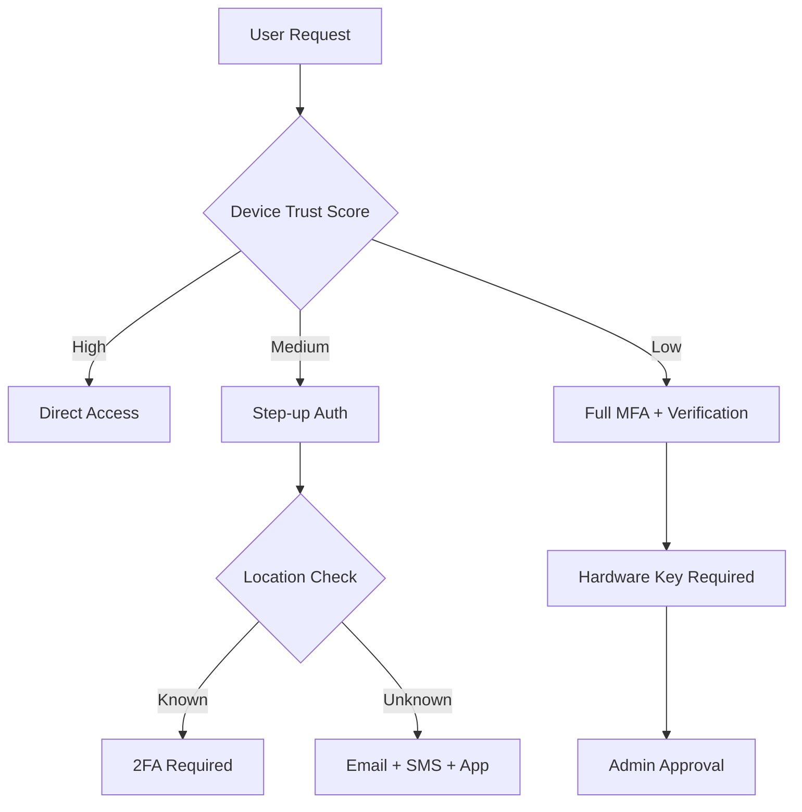
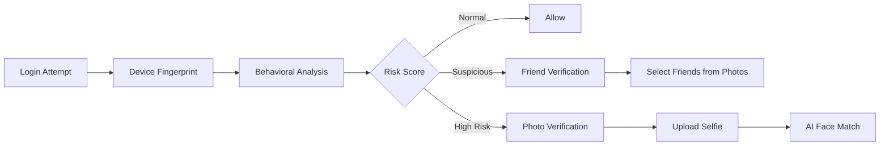
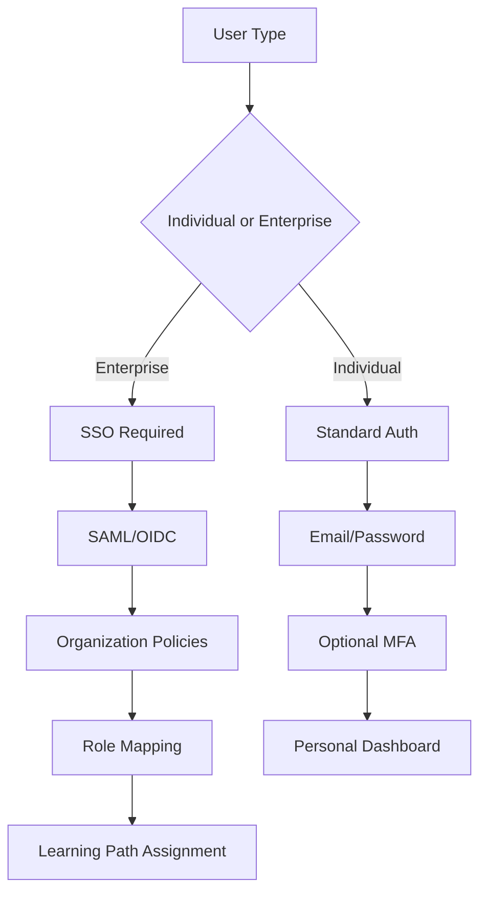
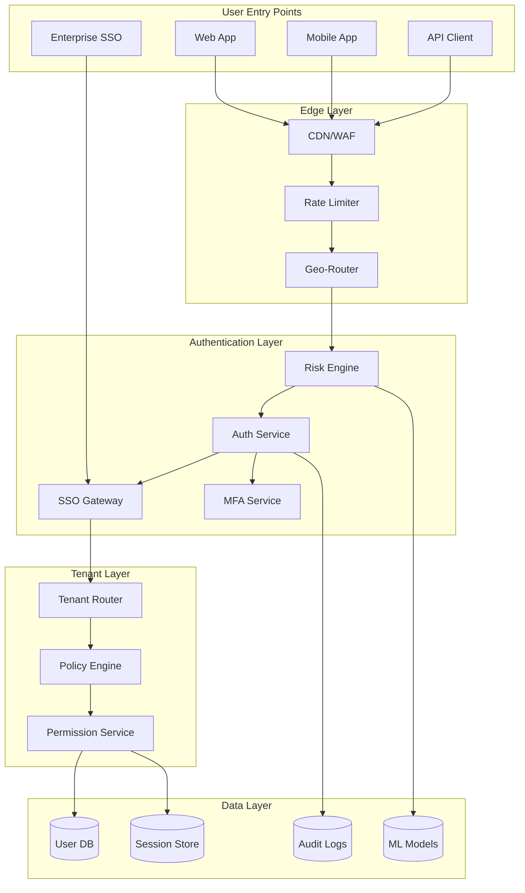

# 🏢 Enterprise Authentication Implementation Plan
## Achieving Google/Facebook/Coursera Level Authentication

---

## 📊 Executive Summary

This document outlines the comprehensive plan to transform Taxomind's authentication system from its current state to an enterprise-grade system comparable to Google, Facebook, YouTube, Coursera, and Udemy.

**Current State**: Basic RBAC with MFA, session management, and audit logging
**Target State**: Enterprise-grade multi-tenant authentication with advanced security, compliance automation, and global scale

**Timeline**: 12-16 months
**Priority**: Critical for enterprise adoption

---

## 🎯 How Enterprise Giants Control User Flow

### 1. **Google's Approach: Zero-Trust + Context-Aware Access**



**Key Insights**:
- Every request is evaluated for risk
- Authentication adapts based on context
- No permanent trust - continuous verification
- ML models predict suspicious behavior

### 2. **Facebook/Meta's Approach: Social Graph + Behavioral Biometrics**



**Key Insights**:
- Social connections as trust anchors
- AI-powered identity verification
- Cross-platform session management
- Real-time threat intelligence sharing

### 3. **Coursera/Udemy's Approach: Enterprise Integration + Learning Context**



**Key Insights**:
- Seamless enterprise integration
- Organization-level policy enforcement
- Bulk user provisioning (SCIM)
- Custom learning paths per organization

---

## 🔍 What Taxomind Currently Lacks

### Critical Missing Components

| Component | Current State | Enterprise Requirement | Impact |
|-----------|--------------|----------------------|---------|
| **SSO Integration** | Basic OAuth only | SAML 2.0, OIDC, LDAP | 🔴 Critical |
| **Multi-tenancy** | Single tenant | Full isolation per org | 🔴 Critical |
| **Risk-based Auth** | Basic fingerprinting | ML-powered risk scoring | 🔴 Critical |
| **API Security** | Session-based only | OAuth 2.0 server, JWT | 🔴 Critical |
| **Compliance** | Manual processes | Automated GDPR/SOC2 | 🟡 High |
| **Identity Verification** | Email only | Document/biometric | 🟡 High |
| **Threat Detection** | Rate limiting only | IP intel, behavior analysis | 🟡 High |
| **Global Scale** | Single region | Edge authentication | 🟢 Medium |

---

## 🏗️ Implementation Architecture

### Phase 1: Foundation (Months 1-3)
**Goal**: Enterprise SSO & Enhanced Security

#### 1.1 Complete SSO Integration

```typescript
// lib/auth/enterprise-sso.ts
export class EnterpriseSSO {
  private providers: Map<string, SSOProvider>;
  
  async authenticate(request: SSORequest): Promise<SSOResponse> {
    const provider = this.getProvider(request.type);
    
    switch(request.type) {
      case 'SAML':
        return this.handleSAML(request);
      case 'OIDC':
        return this.handleOIDC(request);
      case 'LDAP':
        return this.handleLDAP(request);
    }
  }
  
  private async handleSAML(request: SAMLRequest): Promise<SAMLResponse> {
    // 1. Validate SAML assertion
    // 2. Extract user attributes
    // 3. Map to internal user model
    // 4. Create/update user session
  }
}
```

#### 1.2 Advanced Threat Detection

```typescript
// lib/security/threat-detector.ts
export class ThreatDetector {
  private ipIntel: IPIntelligenceService;
  private behaviorAnalyzer: BehaviorAnalyzer;
  private riskScorer: RiskScorer;
  
  async assessThreat(context: AuthContext): Promise<ThreatAssessment> {
    const [ipRisk, behaviorRisk, deviceRisk] = await Promise.all([
      this.ipIntel.analyze(context.ip),
      this.behaviorAnalyzer.analyze(context.userId),
      this.deviceRisk.analyze(context.deviceFingerprint)
    ]);
    
    return this.riskScorer.calculate({
      ip: ipRisk,
      behavior: behaviorRisk,
      device: deviceRisk,
      context: context
    });
  }
}
```

### Phase 2: Multi-tenancy (Months 4-6)
**Goal**: Organization Isolation & Management

#### 2.1 Tenant Architecture

```typescript
// lib/tenant/tenant-manager.ts
export class TenantManager {
  async createTenant(org: Organization): Promise<Tenant> {
    // 1. Create isolated database schema
    // 2. Configure authentication policies
    // 3. Set up custom domain
    // 4. Initialize billing
    
    const tenant = await db.tenant.create({
      data: {
        organizationId: org.id,
        dbSchema: `tenant_${org.id}`,
        authConfig: {
          ssoRequired: org.plan === 'ENTERPRISE',
          mfaPolicy: org.securityLevel,
          passwordPolicy: this.getPasswordPolicy(org),
          sessionTimeout: org.sessionTimeout || 3600
        },
        features: this.getPlanFeatures(org.plan),
        limits: this.getPlanLimits(org.plan)
      }
    });
    
    return tenant;
  }
}
```

#### 2.2 Request Routing

```typescript
// middleware/tenant-middleware.ts
export async function tenantMiddleware(req: Request) {
  const tenant = await identifyTenant(req);
  
  if (!tenant) {
    return unauthorizedResponse();
  }
  
  // Set tenant context for all downstream operations
  setTenantContext(tenant);
  
  // Apply tenant-specific policies
  await applyTenantPolicies(tenant, req);
  
  // Route to tenant-specific resources
  return routeToTenant(tenant, req);
}
```

### Phase 3: Enterprise API & OAuth 2.0 (Months 7-9)
**Goal**: Industry-standard API Authentication

#### 3.1 OAuth 2.0 Authorization Server

```typescript
// lib/oauth/authorization-server.ts
export class OAuth2Server {
  async authorize(request: AuthorizationRequest): Promise<AuthorizationResponse> {
    // Implement OAuth 2.0 flows
    switch(request.grantType) {
      case 'authorization_code':
        return this.authorizationCodeFlow(request);
      case 'client_credentials':
        return this.clientCredentialsFlow(request);
      case 'refresh_token':
        return this.refreshTokenFlow(request);
      case 'device_code':
        return this.deviceCodeFlow(request);
    }
  }
  
  async issueToken(client: Client, scope: string[]): Promise<Token> {
    const token = await this.jwtService.sign({
      sub: client.id,
      aud: client.audience,
      scope: scope,
      exp: Date.now() + 3600000,
      iss: 'https://api.taxomind.com'
    });
    
    return {
      access_token: token,
      token_type: 'Bearer',
      expires_in: 3600,
      refresh_token: await this.issueRefreshToken(client)
    };
  }
}
```

### Phase 4: Compliance Automation (Months 10-12)
**Goal**: Automated GDPR, SOC2, PCI Compliance

#### 4.1 GDPR Automation

```typescript
// lib/compliance/gdpr-manager.ts
export class GDPRManager {
  async handleDataRequest(type: GDPRRequestType, userId: string) {
    switch(type) {
      case 'ACCESS':
        return this.exportUserData(userId);
      case 'ERASURE':
        return this.deleteUserData(userId);
      case 'PORTABILITY':
        return this.generatePortableData(userId);
      case 'RECTIFICATION':
        return this.updateUserData(userId);
    }
  }
  
  async auditDataProcessing(): Promise<GDPRAuditReport> {
    // Automated scanning of all data processing activities
    const activities = await this.scanDataActivities();
    const consent = await this.verifyConsent();
    const retention = await this.checkRetention();
    
    return this.generateReport({
      activities,
      consent,
      retention,
      timestamp: new Date()
    });
  }
}
```

---

## 📋 Detailed Implementation Tasks

### Priority 1: SSO Integration (Week 1-4)

```bash
# Files to create/modify
✅ lib/auth/saml/
  ├── saml-provider.ts       # SAML 2.0 implementation
  ├── saml-validator.ts      # Assertion validation
  ├── attribute-mapper.ts    # Attribute mapping
  └── metadata-generator.ts  # SP metadata generation

✅ lib/auth/oidc/
  ├── oidc-provider.ts       # OpenID Connect
  ├── discovery.ts           # .well-known endpoint
  ├── token-validator.ts     # JWT validation
  └── userinfo-endpoint.ts   # User info endpoint

✅ lib/auth/ldap/
  ├── ldap-connector.ts      # LDAP/AD integration
  ├── bind-authenticator.ts  # Bind authentication
  ├── search-filter.ts       # User search
  └── attribute-sync.ts      # Attribute synchronization
```

### Priority 2: Risk-Based Authentication (Week 5-8)

```bash
# Files to create/modify
✅ lib/security/risk/
  ├── risk-engine.ts         # Main risk calculation
  ├── ml-models/
  │   ├── behavior-model.ts  # User behavior ML
  │   ├── device-model.ts    # Device trust ML
  │   └── location-model.ts  # Geolocation ML
  ├── ip-intelligence.ts     # IP reputation check
  ├── velocity-checker.ts    # Login velocity
  └── adaptive-auth.ts       # Dynamic auth requirements
```

### Priority 3: Multi-Tenancy (Week 9-16)

```bash
# Files to create/modify
✅ lib/tenant/
  ├── tenant-manager.ts      # Tenant lifecycle
  ├── isolation/
  │   ├── db-isolation.ts    # Database isolation
  │   ├── cache-isolation.ts # Cache isolation
  │   └── storage-isolation.ts # File storage isolation
  ├── provisioning/
  │   ├── scim-server.ts     # SCIM 2.0 server
  │   ├── bulk-operations.ts # Bulk user management
  │   └── sync-engine.ts     # Directory sync
  └── billing/
      ├── usage-tracker.ts   # Resource usage
      ├── quota-enforcer.ts  # Quota enforcement
      └── billing-api.ts     # Billing integration
```

---

## 🚀 Implementation Priorities

### Immediate (Month 1)
1. **Complete SAML 2.0 Integration**
   - Required for enterprise customers
   - Unlocks B2B sales

2. **Implement IP Intelligence**
   - Quick security win
   - Reduces fraud/abuse

### Short-term (Months 2-3)
1. **Multi-tenant Database Isolation**
   - Critical for data security
   - Enables enterprise trials

2. **OAuth 2.0 Server**
   - Required for API ecosystem
   - Enables partner integrations

### Medium-term (Months 4-6)
1. **SCIM User Provisioning**
   - Automates enterprise onboarding
   - Reduces support burden

2. **Advanced Threat Detection**
   - ML-based risk scoring
   - Behavioral analytics

### Long-term (Months 7-12)
1. **Global Edge Authentication**
   - Reduces latency globally
   - Improves user experience

2. **Compliance Automation**
   - GDPR/SOC2/PCI automation
   - Reduces compliance costs

---

## 🎓 Learning from LMS Leaders

### Coursera's Model
- **Organization-first**: Every user belongs to an organization (even individuals)
- **Policy Inheritance**: Org policies cascade to all users
- **Learning Context**: Authentication tied to learning goals

### Udemy's Model
- **Marketplace Approach**: Different auth for learners vs instructors
- **Progressive Verification**: More features unlock with verification
- **API-first**: Everything accessible via API

### Implementation for Taxomind

```typescript
// Unified Organization Model (Coursera-style)
interface TaxomindOrg {
  id: string;
  type: 'INDIVIDUAL' | 'TEAM' | 'ENTERPRISE';
  authPolicy: {
    sso?: SSOConfig;
    mfa: 'OPTIONAL' | 'REQUIRED' | 'ENFORCED';
    passwordPolicy: PasswordPolicy;
    sessionPolicy: SessionPolicy;
  };
  learningPolicy: {
    paths: LearningPath[];
    certifications: Certification[];
    assessments: Assessment[];
  };
  billing: {
    plan: 'FREE' | 'PRO' | 'TEAM' | 'ENTERPRISE';
    seats: number;
    usage: UsageMetrics;
  };
}

// Progressive Verification (Udemy-style)
interface VerificationLevels {
  BASIC: {
    verified: ['email'];
    canDo: ['enroll', 'learn'];
  };
  VERIFIED: {
    verified: ['email', 'phone', 'identity'];
    canDo: ['enroll', 'learn', 'review', 'discuss'];
  };
  INSTRUCTOR: {
    verified: ['email', 'phone', 'identity', 'tax_info', 'banking'];
    canDo: ['all_verified', 'create_courses', 'earn_revenue'];
  };
  ENTERPRISE: {
    verified: ['domain', 'business', 'contract'];
    canDo: ['bulk_enrollment', 'custom_branding', 'analytics'];
  };
}
```

---

## 📊 Success Metrics

### Security Metrics
- **Account Takeover Rate**: < 0.001%
- **Failed Auth Attempts**: < 5%
- **MFA Adoption**: > 80% for enterprise
- **SSO Integration Time**: < 2 hours

### Performance Metrics
- **Auth Latency**: < 200ms globally
- **Session Creation**: < 100ms
- **Token Validation**: < 50ms
- **SSO Round-trip**: < 2 seconds

### Business Metrics
- **Enterprise Adoption**: 50+ organizations
- **API Partner Integrations**: 100+ apps
- **Compliance Certifications**: SOC2, GDPR, ISO 27001
- **Support Ticket Reduction**: 60% for auth issues

---

## 🔧 Technical Requirements

### Infrastructure
```yaml
# Minimum Infrastructure Requirements
compute:
  - Auth Service: 4 CPU, 8GB RAM (auto-scaling)
  - SSO Service: 2 CPU, 4GB RAM (redundant)
  - Risk Engine: 8 CPU, 16GB RAM (ML models)

storage:
  - Redis Cluster: 16GB (session storage)
  - PostgreSQL: 100GB (audit logs, user data)
  - S3/Blob: 1TB (document verification)

services:
  - CDN: Global edge locations
  - WAF: DDoS protection
  - Secrets Manager: Key rotation
  - Monitoring: DataDog/NewRelic
```

### Third-party Services
```yaml
required:
  - IP Intelligence: MaxMind GeoIP2
  - Email Service: SendGrid/AWS SES
  - SMS Service: Twilio
  - Payment: Stripe (for billing)

optional:
  - Identity Verification: Jumio/Onfido
  - Threat Intelligence: ThreatConnect
  - SIEM Integration: Splunk/ELK
```

---

## 🎯 Final Architecture



---

## 📝 Conclusion

This plan transforms Taxomind from a basic authentication system to an enterprise-grade platform comparable to Google, Facebook, and leading LMS platforms. The phased approach ensures continuous delivery of value while building toward the complete vision.

**Next Steps**:
1. Approve implementation plan
2. Allocate development resources
3. Begin Phase 1 (SSO Integration)
4. Set up monitoring and metrics
5. Establish security review process

**Estimated Investment**:
- Development: 12-16 months, 4-6 engineers
- Infrastructure: $5-10K/month
- Third-party services: $2-5K/month
- Compliance/Audit: $20-50K one-time

**ROI**:
- Enterprise customer acquisition
- Reduced support costs (60% reduction)
- Improved security posture
- Competitive differentiation
- Platform scalability

---

*Document Version: 1.0*
*Last Updated: January 2025*
*Status: Ready for Implementation*