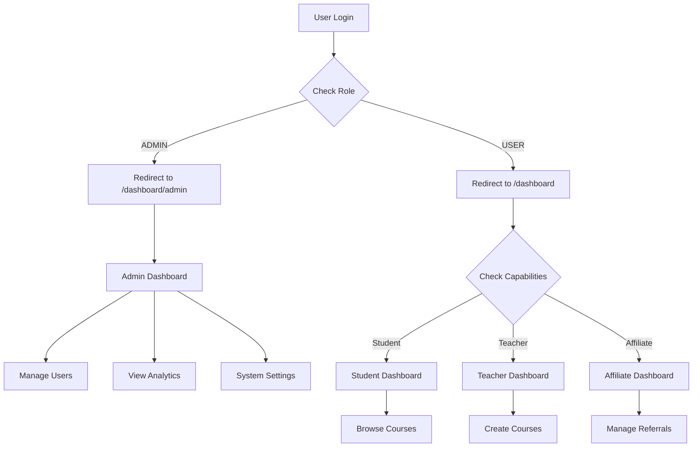

# 🔐 Taxomind Simple Authentication Flow

## Overview

Taxomind uses a **simple two-level authentication system**:
- **ADMIN**: Platform administrators with full control
- **USER**: Regular users (students, teachers, affiliates)

No complex hierarchies, no complicated permissions - just simple, clear separation.

---

## 🎭 Role Structure

### ADMIN Role
- **Purpose**: Manage the entire platform
- **Access**: All administrative functions
- **Dashboard**: `/dashboard/admin`
- **Routes**: `/admin/*`, `/dashboard/admin/*`

### USER Role
- **Purpose**: Use the platform (learn, teach, affiliate)
- **Access**: Platform features based on capabilities
- **Dashboard**: `/dashboard`
- **Capabilities**:
  - Student (default)
  - Teacher (create courses)
  - Affiliate (promote courses)

---

## 🔄 Authentication Flow



---

## 🗂️ File Structure

### Authentication Files
```
middleware.ts              # Route protection and role-based redirects
auth.ts                   # NextAuth configuration
routes.ts                 # Route definitions (public, protected, admin)

lib/
├── auth/
│   ├── admin-manager.ts  # Admin creation and management
│   └── capabilities.ts   # User capability definitions

app/
├── dashboard/
│   ├── page.tsx          # User dashboard (redirects admins)
│   ├── admin/
│   │   └── page.tsx      # Admin dashboard
│   └── _components/
│       └── UnifiedDashboard.tsx  # Context-based user dashboard

components/
└── auth/
    └── admin-guard.tsx   # Admin-only component wrapper
```

---

## 🔑 Login Credentials

### Admin Accounts
| Email | Password | Role | Access |
|-------|----------|------|--------|
| admin@taxomind.com | password123 | ADMIN | Full platform control |
| superadmin@taxomind.com | password123 | ADMIN | Full platform control |

### User Accounts
| Email | Password | Role | Capability |
|-------|----------|------|------------|
| john.teacher@taxomind.com | password123 | USER | Teacher |
| sarah.instructor@taxomind.com | password123 | USER | Teacher |
| alice.student@taxomind.com | password123 | USER | Student |
| bob.learner@taxomind.com | password123 | USER | Student |
| charlie.user@taxomind.com | password123 | USER | Student |
| david.affiliate@taxomind.com | password123 | USER | Affiliate |

---

## 🛣️ Route Protection

### Admin-Only Routes
```typescript
const ADMIN_ONLY_ROUTES = [
  '/admin',
  '/dashboard/admin',
  '/admin/users',
  '/admin/settings',
  '/admin/audit',
];
```

### User Routes (Capability-Based)
```typescript
const CAPABILITY_ROUTES = {
  '/teacher': [UserCapability.TEACHER],
  '/instructor': [UserCapability.TEACHER],
  '/affiliate': [UserCapability.AFFILIATE],
};
```

---

## 💻 Implementation Examples

### 1. Checking User Role
```typescript
// In a server component
import { currentUser } from "@/lib/auth";

const user = await currentUser();

if (user?.role === "ADMIN") {
  // Admin logic
} else {
  // User logic
}
```

### 2. Protecting Admin Routes
```typescript
// Using AdminGuard component
import { AdminGuard } from "@/components/auth/admin-guard";

export default function AdminPage() {
  return (
    <AdminGuard>
      {/* Admin-only content */}
    </AdminGuard>
  );
}
```

### 3. Middleware Protection
```typescript
// middleware.ts automatically handles this
if (userRole === "ADMIN") {
  // Allow all routes
} else if (pathname.startsWith('/admin')) {
  // Redirect to user dashboard
  return NextResponse.redirect('/dashboard');
}
```

---

## 🚀 Quick Start

1. **Start the application**:
   ```bash
   npm run dev
   ```

2. **Login as Admin**:
   - Go to `/auth/login`
   - Use `admin@taxomind.com` / `password123`
   - You'll be redirected to `/dashboard/admin`

3. **Login as User**:
   - Go to `/auth/login`
   - Use any user email / `password123`
   - You'll be redirected to `/dashboard`

---

## 🎯 Key Principles

1. **Simplicity First**: Just two roles - ADMIN and USER
2. **Clear Separation**: Admins and users have completely different dashboards
3. **No Complexity**: No role hierarchies, no permission matrices
4. **Capability-Based**: Users have capabilities (teacher, student, affiliate) not roles
5. **Easy to Understand**: Any developer can understand the flow in 5 minutes

---

## 🔧 Database Schema

```prisma
enum UserRole {
  ADMIN
  USER
}

model User {
  id                String    @id
  email             String    @unique
  name              String?
  role              UserRole  @default(USER)
  
  // Capabilities (for USER role only)
  isTeacher         Boolean   @default(false)
  isAffiliate       Boolean   @default(false)
  
  // ... other fields
}
```

---

## 📊 Decision Flow

```
User logs in
    ↓
Is role ADMIN?
    ├─ Yes → /dashboard/admin (Admin Dashboard)
    │         ├─ User Management
    │         ├─ Platform Analytics
    │         └─ System Settings
    │
    └─ No → /dashboard (User Dashboard)
              ├─ Is Teacher? → Show teaching tools
              ├─ Is Affiliate? → Show affiliate tools
              └─ Default → Show student interface
```

---

## 🚫 What We DON'T Have

- ❌ Complex role hierarchies
- ❌ Granular permissions
- ❌ Role inheritance
- ❌ Dynamic role creation
- ❌ Permission matrices
- ❌ Multi-level approvals

## ✅ What We DO Have

- ✅ Simple ADMIN/USER separation
- ✅ Clear authentication flow
- ✅ Easy to maintain
- ✅ Fast to understand
- ✅ Secure by default
- ✅ Production ready

---

## 🎓 Summary

The Taxomind authentication system is intentionally simple:
- **2 Roles**: ADMIN and USER
- **Clear Separation**: Different dashboards, different purposes
- **No Complexity**: Easy to understand, easy to maintain
- **Production Ready**: Secure and scalable

This simplicity is a feature, not a limitation. It makes the system:
- Easier to debug
- Faster to develop
- Simpler to explain
- More secure (less complexity = fewer vulnerabilities)

---

*Last Updated: January 2025*
*Version: 1.0.0*