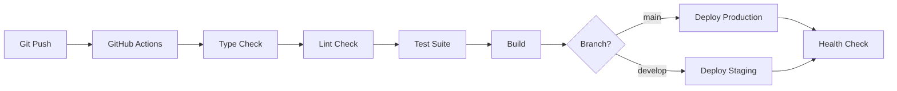

# Taxomind - Comprehensive System Architecture

**Version**: 1.0.0
**Last Updated**: January 18, 2025
**Platform**: Next.js 15 + PostgreSQL + Prisma ORM
**Classification**: Enterprise Learning Management System (LMS)

---

## 📋 Table of Contents

1. [System Overview](#system-overview)
2. [Technology Stack](#technology-stack)
3. [Project Structure](#project-structure)
4. [Backend Architecture](#backend-architecture)
5. [Frontend Architecture](#frontend-architecture)
6. [Database Architecture](#database-architecture)
7. [SAM AI System](#sam-ai-system)
8. [Authentication & Authorization](#authentication--authorization)
9. [API Architecture](#api-architecture)
10. [Configuration Files](#configuration-files)
11. [Build & Deployment](#build--deployment)
12. [Testing Infrastructure](#testing-infrastructure)
13. [Monitoring & Observability](#monitoring--observability)
14. [Infrastructure & DevOps](#infrastructure--devops)

---

## 🎯 System Overview

### Platform Purpose

Taxomind is an **enterprise-grade intelligent learning management system** that combines:
- 🎓 Traditional LMS capabilities (courses, chapters, sections)
- 🤖 AI-powered adaptive learning (SAM AI Tutor)
- 📊 Advanced analytics and predictive insights
- 🎮 Gamification and social learning
- 💼 Business intelligence and market analysis

### Key Characteristics

| Characteristic | Value |
|----------------|-------|
| **Type** | Monolithic Next.js Application (App Router) |
| **Rendering** | Hybrid (Server Components + Client Components) |
| **Database** | PostgreSQL with Prisma ORM |
| **Authentication** | NextAuth.js v5 (Google-style RBAC) |
| **AI Provider** | Anthropic Claude (primary), OpenAI (planned) |
| **Deployment** | Railway (production), Vercel-compatible |
| **Codebase Size** | 150,000+ lines of TypeScript/TSX |
| **API Endpoints** | 200+ RESTful routes |

---

## 🛠️ Technology Stack

### Core Framework

```yaml
Framework: Next.js 15.5.4
Language: TypeScript 5.6.2 (strict mode)
React: 19.0.0
Node.js: 18+ required
```

### Backend Technologies

| Technology | Version | Purpose |
|------------|---------|---------|
| **Next.js Server** | 15.5.4 | API routes, server actions, middleware |
| **Prisma** | 5.x | ORM and database management |
| **PostgreSQL** | 14+ | Primary database |
| **NextAuth.js** | 5.0.0-beta.25 | Authentication & session management |
| **Redis** | (Upstash) | Caching and rate limiting |
| **Zod** | 3.x | Runtime schema validation |

### Frontend Technologies

| Technology | Version | Purpose |
|------------|---------|---------|
| **React** | 19.0.0 | UI library |
| **Tailwind CSS** | 3.4.17 | Utility-first CSS framework |
| **Radix UI** | Latest | Headless UI components |
| **Lucide React** | Latest | Icon library |
| **React Hook Form** | 7.x | Form management |
| **TanStack Query** | (planned) | Data fetching and caching |

### AI & Machine Learning

| Technology | Purpose |
|------------|---------|
| **Anthropic Claude** | Primary AI provider (cognitive analysis, content generation) |
| **OpenAI** | Secondary AI provider (embeddings, chat) |
| **Custom ML** | Planned (predictive analytics, recommendation engine) |

### DevOps & Infrastructure

| Technology | Purpose |
|------------|---------|
| **Railway** | Production deployment |
| **Docker** | Containerization |
| **Kubernetes** | Orchestration (planned) |
| **Terraform** | Infrastructure as Code |
| **Prometheus** | Metrics collection |
| **Grafana** | Metrics visualization |
| **Sentry** | Error tracking |

---

## 📂 Project Structure

### Root Directory Layout

```
taxomind/
├── 📱 Frontend & UI
│   ├── app/                    # Next.js 15 App Router pages
│   ├── components/             # React components library
│   ├── styles/                 # Global styles
│   └── public/                 # Static assets
│
├── 🔧 Backend & Business Logic
│   ├── lib/                    # Core business logic
│   ├── actions/                # Server actions
│   ├── api/                    # Legacy API routes
│   └── prisma/                 # Database schema & migrations
│
├── ⚙️ Configuration
│   ├── config/                 # Application configuration
│   ├── *.config.{js,ts}        # Build/tool configurations
│   └── auth*.ts                # Authentication configs
│
├── 🧪 Testing
│   ├── __tests__/              # Jest unit & integration tests
│   ├── e2e/                    # Playwright end-to-end tests
│   └── k6-config/              # Load testing
│
├── 🚀 DevOps
│   ├── infrastructure/         # Terraform, Kubernetes manifests
│   ├── scripts/                # Build & deployment scripts
│   └── .github/workflows/      # CI/CD pipelines
│
├── 📚 Documentation
│   ├── docs/                   # Comprehensive documentation
│   └── README.md               # Project overview
│
└── 🗂️ Utilities
    ├── hooks/                  # Custom React hooks
    ├── types/                  # TypeScript type definitions
    ├── utils/                  # Utility functions
    └── schemas/                # Validation schemas
```

---

## 🔧 Backend Architecture

### Core Backend Structure

```
lib/
├── 🧠 AI & Intelligence
│   ├── sam-*.ts                       # 35+ SAM AI engines
│   ├── adaptive-content/              # Adaptive learning logic
│   ├── cognitive-load/                # Cognitive load optimization
│   ├── emotion-detection/             # Student emotion analysis
│   └── ml-training/                   # Machine learning models
│
├── 🔐 Authentication & Security
│   ├── auth/                          # NextAuth.js configuration
│   │   ├── capabilities.ts            # User capability system
│   │   ├── context-manager.ts         # Context switching
│   │   └── admin-manager.ts           # Admin management
│   ├── security/                      # Security utilities
│   └── audit/                         # Audit logging
│
├── 💾 Data Access Layer
│   ├── db.ts                          # Prisma client singleton
│   ├── database/                      # Database utilities
│   ├── repositories/                  # Repository pattern
│   └── services/                      # Business services
│
├── 📊 Analytics & Monitoring
│   ├── analytics/                     # User analytics
│   ├── monitoring/                    # System monitoring
│   └── logging/                       # Centralized logging
│
├── 🎮 Features
│   ├── badge/                         # Gamification badges
│   ├── certificate/                   # Course certificates
│   ├── collaborative-editing/         # Real-time collaboration
│   ├── content-templates/             # Reusable content
│   ├── knowledge-graph/               # Learning graph
│   ├── microlearning/                 # Bite-sized lessons
│   ├── prerequisite-tracking/         # Course prerequisites
│   ├── spaced-repetition/             # Learning optimization
│   └── job-market-mapping/            # Career alignment
│
├── 🔌 Integrations
│   ├── external-integrations/         # Third-party APIs
│   ├── email/                         # Email service
│   ├── storage/                       # File storage (Cloudinary)
│   └── websocket/                     # Real-time communication
│
├── ⚡ Performance
│   ├── cache/                         # Caching layer
│   ├── redis/                         # Redis client
│   └── performance/                   # Performance utilities
│
└── 🛠️ Utilities
    ├── utils/                         # Helper functions
    ├── validators/                    # Input validation
    ├── error-handling/                # Error management
    └── types/                         # TypeScript types
```

### Key Backend Files Purpose

| File/Directory | Purpose | Key Features |
|----------------|---------|--------------|
| **`lib/db.ts`** | Prisma client singleton | Connection pooling, error handling |
| **`lib/auth.ts`** | Authentication helpers | `currentUser()`, session management |
| **`lib/logger.ts`** | Centralized logging | Winston logger, structured logs |
| **`lib/sam-*.ts`** | SAM AI engines | 35+ specialized AI engines |
| **`lib/services/`** | Business logic services | Course, User, Payment services |
| **`lib/repositories/`** | Data access layer | Repository pattern, query optimization |

---

## 🎨 Frontend Architecture

### Frontend Structure

```
app/                             # Next.js 15 App Router
├── 📄 Route Groups
│   ├── (auth)/                  # Authentication pages
│   │   ├── login/
│   │   ├── register/
│   │   └── error/
│   │
│   ├── (homepage)/              # Public homepage
│   │   ├── page.tsx
│   │   └── _components/
│   │
│   ├── (dashboard)/             # User dashboards
│   │   ├── admin/              # Admin dashboard
│   │   ├── teacher/            # Teacher dashboard
│   │   └── student/            # Student dashboard
│   │
│   ├── (course)/                # Course learning interface
│   │   └── courses/[courseId]/learn/
│   │
│   └── (protected)/             # Protected routes
│       ├── settings/
│       ├── teacher/courses/
│       └── profile/
│
├── 🔌 API Routes
│   └── api/
│       ├── auth/               # NextAuth.js endpoints
│       ├── courses/            # Course CRUD
│       ├── sam/                # SAM AI endpoints (80+)
│       ├── analytics/          # Analytics APIs
│       └── admin/              # Admin APIs
│
├── 📝 Shared Files
│   ├── layout.tsx              # Root layout (SAM integration)
│   ├── globals.css             # Global styles
│   └── error.tsx               # Error boundary
│
└── 🧪 Test Pages
    ├── test-*/                 # Development test pages
    └── api-test/               # API testing pages
```

### Component Library Structure

```
components/
├── 🎨 UI Components (Radix UI based)
│   └── ui/
│       ├── button.tsx
│       ├── card.tsx
│       ├── input.tsx
│       ├── dialog.tsx
│       ├── tabs.tsx
│       └── ... (50+ components)
│
├── 🏗️ Layout Components
│   ├── layout/
│   │   ├── layout-with-sidebar.tsx
│   │   ├── enhanced-sidebar.tsx
│   │   └── home-sidebar.tsx
│   ├── header/
│   └── navbar/
│
├── 🔐 Authentication Components
│   └── auth/
│       ├── login-form.tsx
│       ├── register-form.tsx
│       └── social-auth-buttons.tsx
│
├── 📚 Course Components
│   ├── course-creation/
│   ├── dashboard/
│   └── content/
│
├── 🤖 SAM AI Components
│   └── sam/
│       ├── sam-global-provider.tsx
│       ├── sam-global-assistant.tsx
│       ├── sam-context-manager.tsx
│       └── sam-contextual-chat.tsx
│
├── 📊 Analytics Components
│   └── analytics/
│       ├── charts/
│       └── dashboards/
│
├── 🎮 Gamification Components
│   ├── badge/
│   └── leaderboard/
│
└── 🛡️ Security & Error Components
    ├── error-boundary/
    └── security/
```

### Key Frontend Files Purpose

| File/Directory | Purpose | Key Features |
|----------------|---------|--------------|
| **`app/layout.tsx`** | Root layout | SAM global integration, theme providers |
| **`components/ui/`** | Radix UI components | Accessible, customizable components |
| **`components/sam/`** | SAM AI components | Global floating assistant, chat interface |
| **`components/providers/`** | Context providers | Auth, theme, SAM context |
| **`hooks/`** | Custom React hooks | `useSAMGlobal`, `useAuth`, `useAnalytics` |

---

## 💾 Database Architecture

### Prisma Schema Organization

Taxomind uses a **modular Prisma schema** approach:

```
prisma/
├── schema.prisma               # Merged schema (auto-generated)
│
├── domains/                    # Domain-specific schemas
│   ├── 01-base.prisma          # Base enums and types
│   ├── 02-auth.prisma          # User, Session, Account
│   ├── 03-profile.prisma       # UserProfile
│   ├── 04-content.prisma       # Course, Chapter, Section
│   ├── 05-assessment.prisma    # Exam, Question, UserExamSubmission
│   ├── 06-analytics.prisma     # UserAnalytics, CourseAnalytics
│   ├── 07-gamification.prisma  # Badge, Achievement, Streak
│   ├── 08-commerce.prisma      # Purchase, Bill, Payment
│   ├── 09-social.prisma        # Post, Comment, Collaboration
│   ├── 10-ai-sam.prisma        # SAMInteraction, BloomsAnalysis
│   ├── 11-admin.prisma         # AdminLog, AuditLog
│   ├── 12-user-preferences.prisma # User settings
│   └── 13-course-enhancements.prisma # Advanced features
│
└── migrations/                 # Database migrations
    ├── 20250101000000_init/
    └── ...
```

### Database Models Overview

| Domain | Models | Purpose |
|--------|--------|---------|
| **Authentication** | User, Session, Account, VerificationToken | NextAuth.js integration |
| **Profile** | UserProfile | Extended user information |
| **Content** | Course, Chapter, Section, Attachment | Learning content hierarchy |
| **Assessment** | Exam, Question, ExamQuestion, UserExamSubmission | Testing and quizzes |
| **Analytics** | UserAnalytics, CourseAnalytics, VideoProgress | Usage tracking |
| **Gamification** | Badge, Achievement, Streak, Leaderboard | Motivation system |
| **Commerce** | Purchase, Bill, Payment, Enrollment | Payments and access |
| **Social** | Post, PostChapter, Comment | Community features |
| **AI/SAM** | SAMInteraction, CourseBloomsAnalysis, SectionBloomsMapping | AI system |
| **Admin** | AdminLog, AuditLog | System administration |

### Key Database Commands

```bash
# Schema Management
npm run schema:merge          # Merge domain schemas into schema.prisma
npm run schema:validate       # Validate merged schema
npm run schema:split          # Split schema into domains

# Migrations
npm run db:migrate            # Apply migrations (production)
npm run db:migrate:dev        # Create and apply migration (dev)
npm run db:push               # Push schema without migration

# Database Access
npx prisma studio             # Visual database browser
```

---

## 🤖 SAM AI System

### SAM Architecture Overview

SAM (Smart Adaptive Mentor) is the **core AI intelligence** of Taxomind:

```
SAM AI System
├── 🧠 Core Foundation
│   └── lib/sam-base-engine.ts        # Abstract base class
│
├── 🎓 Educational Intelligence (6 engines)
│   ├── sam-blooms-engine.ts          # Bloom's Taxonomy analysis
│   ├── sam-personalization-engine.ts  # Learning style detection
│   ├── sam-analytics-engine.ts       # Learning analytics
│   ├── sam-predictive-engine.ts      # Outcome forecasting
│   ├── sam-achievement-engine.ts     # Gamification system
│   └── sam-contextual-intelligence.ts # Context awareness
│
├── 🎨 Content Generation (4 engines)
│   ├── sam-generation-engine.ts      # AI content creation
│   ├── sam-course-architect.ts       # Course structure design
│   ├── sam-exam-engine.ts            # Assessment creation
│   └── sam-multimedia-engine.ts      # Media processing
│
├── 📦 Resource Management (3 engines)
│   ├── sam-resource-engine.ts        # Learning resources
│   ├── sam-news-engine.ts            # AI news aggregation
│   └── sam-trends-engine.ts          # Trend analysis
│
├── 🤝 Social Learning (3 engines)
│   ├── sam-collaboration-engine.ts   # Study group formation
│   ├── sam-social-engine.ts          # Peer learning
│   └── sam-course-guide-engine.ts    # Course guidance
│
├── 💼 Business Intelligence (3 engines)
│   ├── sam-financial-engine.ts       # Pricing optimization
│   ├── sam-market-engine.ts          # Market analysis
│   └── sam-enterprise-engine.ts      # B2B features
│
└── 🔧 Advanced AI (10+ engines)
    ├── sam-memory-engine.ts          # Conversation memory
    ├── sam-enhanced-context.ts       # Advanced context
    ├── sam-innovation-engine.ts      # Innovation features
    └── ... (additional specialized engines)
```

### SAM API Endpoints

**Location**: `app/api/sam/**`

| Endpoint Category | Count | Examples |
|-------------------|-------|----------|
| **AI Tutor** | 20+ | `/api/sam/ai-tutor/chat`, `/api/sam/ai-tutor/achievements` |
| **Content** | 15+ | `/api/sam/generate-course-structure-complete` |
| **Analytics** | 10+ | `/api/sam/analytics/comprehensive` |
| **Personalization** | 8+ | `/api/sam/personalization`, `/api/sam/learning-profile` |
| **Assessment** | 10+ | `/api/sam/exam-engine/adaptive` |
| **Business** | 10+ | `/api/sam/financial-intelligence`, `/api/sam/course-market-analysis` |
| **Gamification** | 5+ | `/api/sam/gamification/achievements` |

**Total SAM API Endpoints**: 80+

---

## 🔐 Authentication & Authorization

### Authentication Architecture

**System**: NextAuth.js v5 (Google-style RBAC)

```
Authentication Flow
├── 📝 Roles (2 types)
│   ├── ADMIN            # Platform administrators
│   └── USER             # All other users
│
└── 🎯 Capabilities (6+ types)
    ├── STUDENT          # Default for all users
    ├── TEACHER          # Create courses
    ├── AFFILIATE        # Promote courses
    ├── CONTENT_CREATOR  # Write blog posts
    ├── MODERATOR        # Moderate content
    └── REVIEWER         # Review courses
```

### Auth Configuration Files

| File | Purpose |
|------|---------|
| **`auth.ts`** | Main NextAuth.js configuration (user auth) |
| **`auth.admin.ts`** | Separate admin authentication |
| **`auth.config.ts`** | User auth config |
| **`auth.config.admin.ts`** | Admin auth config |
| **`auth.config.edge.ts`** | Edge runtime user auth |
| **`auth.config.admin.edge.ts`** | Edge runtime admin auth |
| **`middleware.ts`** | Route protection and role-based redirects |
| **`routes.ts`** | Route access control configuration |

### Route Protection

```typescript
// middleware.ts
export const config = {
  matcher: [
    '/dashboard/:path*',
    '/teacher/:path*',
    '/admin/:path*',
    '/settings/:path*'
  ]
};
```

**Protection Levels**:
- 🔓 **Public**: `/`, `/courses`, `/blog`
- 🔐 **Protected**: `/dashboard`, `/profile`, `/settings`
- 👨‍🏫 **Teacher Only**: `/teacher/courses`, `/teacher/create`
- 👑 **Admin Only**: `/admin`, `/dashboard/admin`

---

## 🔌 API Architecture

### API Structure

```
app/api/
├── 🔐 Authentication
│   └── auth/[...nextauth]/route.ts
│
├── 📚 Course Management (50+ endpoints)
│   ├── courses/
│   │   ├── [courseId]/
│   │   │   ├── route.ts                     # CRUD operations
│   │   │   ├── chapters/[chapterId]/
│   │   │   └── sections/[sectionId]/
│   │   └── route.ts
│
├── 🤖 SAM AI System (80+ endpoints)
│   ├── sam/
│   │   ├── ai-tutor/                        # AI tutoring
│   │   ├── blooms-analysis/                 # Cognitive analysis
│   │   ├── personalization/                 # Adaptive learning
│   │   ├── analytics/                       # Analytics
│   │   ├── gamification/                    # Achievements
│   │   └── ... (many more)
│
├── 📊 Analytics (20+ endpoints)
│   └── analytics/
│       ├── events/route.ts
│       └── dashboard/route.ts
│
├── 👤 User Management
│   ├── users/[userId]/route.ts
│   └── profile/route.ts
│
├── 💳 Commerce
│   ├── purchases/route.ts
│   └── payments/route.ts
│
└── 👑 Admin (30+ endpoints)
    └── admin/
        ├── users/route.ts
        ├── courses/route.ts
        └── analytics/route.ts
```

### API Response Format

**Standard Response Structure**:
```typescript
interface ApiResponse<T = unknown> {
  success: boolean;
  data?: T;
  error?: {
    code: string;
    message: string;
    details?: Record<string, unknown>;
  };
  metadata?: {
    timestamp: string;
    requestId: string;
    version: string;
  };
}
```

**Total API Endpoints**: 200+

---

## ⚙️ Configuration Files

### Root Configuration Files

| File | Purpose | Key Settings |
|------|---------|--------------|
| **`next.config.js`** | Next.js configuration | Webpack, image optimization, redirects |
| **`tailwind.config.ts`** | Tailwind CSS config | Theme, colors, plugins |
| **`tsconfig.json`** | TypeScript config | Strict mode, path aliases |
| **`postcss.config.js`** | PostCSS config | Tailwind CSS processing |
| **`components.json`** | Shadcn/ui config | Component library setup |
| **`.eslintrc.json`** | ESLint config | Linting rules, plugins |
| **`.prettierrc.json`** | Prettier config | Code formatting rules |

### Environment Files

```bash
# Development
.env.local              # Local development secrets
.env.development        # Development configuration

# Staging
.env.staging            # Staging environment

# Production
.env.production         # Production configuration
```

**Key Environment Variables**:
```bash
# Database
DATABASE_URL=postgresql://...
DIRECT_URL=postgresql://...

# Authentication
NEXTAUTH_SECRET=***
NEXTAUTH_URL=http://localhost:3000

# AI Providers
ANTHROPIC_API_KEY=***
OPENAI_API_KEY=***

# Services
CLOUDINARY_CLOUD_NAME=***
UPSTASH_REDIS_REST_URL=***
```

### Build Configuration Files

| File | Purpose |
|------|---------|
| **`package.json`** | Dependencies, scripts |
| **`tsconfig.build.json`** | Build-specific TS config |
| **`jest.config.js`** | Jest testing config |
| **`playwright.config.ts`** | E2E testing config |
| **`railway.json`** | Railway deployment config |

---

## 🚀 Build & Deployment

### Build Scripts

**Development**:
```bash
npm run dev                    # Start dev server (Turbopack)
npm run dev:clean              # Clean start with CSS fixes
```

**Production Build**:
```bash
npm run build                  # Standard production build
npm run build:optimized        # Optimized build
npm run build:validate         # Build with validation
npm run build:clean            # Clean build
```

**Type Checking**:
```bash
npm run typecheck              # Full TypeScript check
npm run typecheck:fast         # Fast incremental check
npm run typecheck:watch        # Watch mode
```

**Linting**:
```bash
npm run lint                   # Full ESLint check
npm run lint:fix               # Auto-fix issues
npm run lint:fast              # Fast cached linting
```

### Deployment Environments

| Environment | Platform | URL | Branch |
|-------------|----------|-----|--------|
| **Development** | Local | http://localhost:3000 | feature/* |
| **Staging** | Railway | staging.taxomind.com | develop |
| **Production** | Railway | taxomind.com | main |

### Deployment Process



**Railway Deployment**:
```bash
npm run enterprise:deploy:staging      # Deploy to staging
npm run enterprise:deploy:production   # Deploy to production
```

---

## 🧪 Testing Infrastructure

### Test Types

```
__tests__/
├── 🧩 Unit Tests
│   ├── actions/               # Server action tests
│   ├── lib/                   # Library function tests
│   ├── hooks/                 # Custom hook tests
│   └── utils/                 # Utility function tests
│
├── 🔌 Integration Tests
│   ├── api/                   # API endpoint tests
│   ├── components/            # Component integration tests
│   └── integration/           # Cross-module tests
│
├── 🎭 E2E Tests
│   ├── e2e/                   # Playwright tests
│   │   ├── tests/
│   │   ├── fixtures/
│   │   └── pages/
│   └── visual-regression/     # Visual regression tests
│
└── ⚡ Performance Tests
    └── k6-config/             # Load testing scripts
```

### Test Commands

```bash
# Unit & Integration Tests
npm test                       # Run all Jest tests
npm run test:watch             # Watch mode
npm run test:coverage          # Coverage report
npm run test:ci                # CI mode

# E2E Tests
npm run test:e2e               # Run Playwright tests
npm run test:e2e:ui            # Playwright UI mode
npm run test:e2e:headed        # Headed browser mode

# Load Testing
npm run test:load              # K6 load tests
npm run test:stress            # Stress tests
```

### Test Configuration

| File | Purpose |
|------|---------|
| **`jest.config.js`** | Main Jest configuration |
| **`jest.config.working.js`** | Working test config |
| **`jest.setup.js`** | Test environment setup |
| **`playwright.config.ts`** | E2E test configuration |
| **`k6-config/`** | Load testing scripts |

**Test Coverage Thresholds**:
- Branches: 70%
- Functions: 70%
- Lines: 70%
- Statements: 70%

---

## 📊 Monitoring & Observability

### Monitoring Stack

```
Observability Stack
├── 📈 Metrics
│   ├── Prometheus              # Metrics collection
│   ├── Grafana                 # Visualization
│   └── Custom metrics          # Application metrics
│
├── 🔍 Logging
│   ├── Winston                 # Structured logging
│   ├── Morgan                  # HTTP logging
│   └── lib/logger.ts           # Centralized logger
│
├── 🚨 Error Tracking
│   ├── Sentry                  # Error monitoring
│   ├── sentry.server.config.ts
│   └── sentry.edge.config.ts
│
└── 📊 Analytics
    ├── Custom analytics        # User behavior
    └── lib/analytics/          # Analytics engine
```

### Monitoring Files

```
monitoring/
├── prometheus/
│   └── prometheus.yml
├── grafana/
│   ├── dashboards/
│   └── provisioning/
├── alertmanager/
│   └── alertmanager.yml
└── otel/                      # OpenTelemetry
    └── instrumentation.ts
```

### Health Check Endpoints

```bash
/api/healthcheck              # Basic health
/api/health/detailed          # Detailed health
/api/metrics                  # Prometheus metrics
```

---

## 🏗️ Infrastructure & DevOps

### Infrastructure Structure

```
infrastructure/
├── 🐳 Docker
│   ├── Dockerfile
│   ├── docker-compose.yml
│   └── docker-compose.dev.yml
│
├── ☸️ Kubernetes
│   └── kubernetes/
│       ├── deployments/
│       ├── services/
│       ├── ingress/
│       └── configmaps/
│
├── 🏗️ Terraform
│   └── terraform/
│       ├── main.tf
│       ├── variables.tf
│       └── modules/
│
└── ⎈ Helm Charts
    └── helm/
        ├── Chart.yaml
        └── templates/
```

### CI/CD Pipeline

```
.github/workflows/
├── ci.yml                     # Continuous Integration
├── cd.yml                     # Continuous Deployment
├── test.yml                   # Test automation
├── security.yml               # Security scanning
└── lighthouse.yml             # Performance testing
```

**Pipeline Stages**:
1. **Code Quality**: Lint, TypeScript check
2. **Testing**: Unit, integration, E2E tests
3. **Security**: Dependency scanning, SAST
4. **Build**: Production build
5. **Deploy**: Railway deployment
6. **Verify**: Health checks, smoke tests

---

## 📚 Additional Resources

### Documentation Structure

```
docs/
├── 📖 Core Documentation
│   ├── README.md
│   ├── CLAUDE.md                    # AI assistant instructions
│   └── AUTHENTICATION_ARCHITECTURE.md
│
├── 🏗️ System Architecture
│   └── system-architecture/
│       ├── COMPREHENSIVE_SYSTEM_ARCHITECTURE.md (this file)
│       ├── ROLE_BASED_SYSTEM.md
│       ├── DATABASE_PERFORMANCE_OPTIMIZATION.md
│       └── REDIS_CACHING_STRATEGY.md
│
├── 🤖 SAM AI Documentation
│   ├── architecture/sam-ai-tutor/
│   │   ├── 00-OVERVIEW.md
│   │   ├── 02-CORE-ENGINES.md
│   │   ├── 03-SPECIALIZED-ENGINES.md
│   │   ├── 07-WORKFLOWS.md
│   │   └── 08-FILE-MAPPING.md
│   └── SAM_AI_TEACHER_POWER_ANALYSIS_REPORT.md
│
├── 🚀 Deployment
│   └── deployment/
│       ├── PRODUCTION_DEPLOYMENT_GUIDE.md
│       ├── RAILWAY_DEPLOYMENT_GUIDE.md
│       └── ENTERPRISE_GUIDE.md
│
├── 🧪 Testing
│   └── testing/
│       └── testing-guides/
│
└── 🔌 API Documentation
    ├── api/
    │   ├── README.md
    │   └── endpoints.md
    └── api-documentation/
```

### Key Documentation Files

| Document | Purpose |
|----------|---------|
| **`README.md`** | Project overview and getting started |
| **`CLAUDE.md`** | Enterprise coding standards and AI instructions |
| **`SAM_AI_TEACHER_POWER_ANALYSIS_REPORT.md`** | SAM system analysis |
| **`docs/AUTHENTICATION_ARCHITECTURE.md`** | Auth system details |
| **`docs/deployment/PRODUCTION_DEPLOYMENT_GUIDE.md`** | Production deployment steps |

---

## 🎯 Quick Start Guide

### Prerequisites

```bash
Node.js: 18+ required
PostgreSQL: 14+ required
npm: 9+ required
```

### Installation

```bash
# 1. Clone repository
git clone https://github.com/Shahabul87/taxomind.git
cd taxomind

# 2. Install dependencies
npm install

# 3. Setup environment
cp .env.example .env.local
# Edit .env.local with your values

# 4. Setup database
npm run db:push

# 5. Start development server
npm run dev
```

### Access Points

- **Development**: http://localhost:3000
- **API Documentation**: http://localhost:3000/api
- **Prisma Studio**: `npx prisma studio`

---

## 📊 System Metrics

### Codebase Statistics

| Metric | Count |
|--------|-------|
| **Total Files** | 2,000+ |
| **TypeScript/TSX Files** | 1,500+ |
| **Lines of Code** | 150,000+ |
| **Components** | 300+ |
| **API Endpoints** | 200+ |
| **Database Models** | 50+ |
| **SAM AI Engines** | 35+ |
| **Test Files** | 200+ |

### Performance Targets

| Metric | Target |
|--------|--------|
| **First Contentful Paint (FCP)** | < 1.5s |
| **Time to Interactive (TTI)** | < 3.0s |
| **Largest Contentful Paint (LCP)** | < 2.5s |
| **Cumulative Layout Shift (CLS)** | < 0.1 |
| **API Response Time (p95)** | < 200ms |
| **Database Query Time (p95)** | < 50ms |

---

## 🔄 Version History

| Version | Date | Major Changes |
|---------|------|---------------|
| **1.0.0** | Jan 2025 | Initial comprehensive architecture documentation |

---

## 📝 Maintenance Notes

### Regular Maintenance Tasks

**Daily**:
- ✅ Monitor error logs (Sentry)
- ✅ Check performance metrics (Grafana)
- ✅ Review security alerts

**Weekly**:
- ✅ Update dependencies (`npm outdated`)
- ✅ Review database performance
- ✅ Clear old logs
- ✅ Backup database

**Monthly**:
- ✅ Security audit (`npm audit`)
- ✅ Performance testing (Lighthouse)
- ✅ Documentation updates
- ✅ Dependency major version updates

---

## 🤝 Contributing

### Development Workflow

1. Create feature branch: `git checkout -b feature/your-feature`
2. Make changes
3. Run tests: `npm test`
4. Run linting: `npm run lint:fix`
5. Commit: `git commit -m "feat: your feature"`
6. Push: `git push origin feature/your-feature`
7. Create Pull Request

### Coding Standards

- ✅ TypeScript strict mode
- ✅ ESLint rules enforced
- ✅ Prettier formatting
- ✅ 70%+ test coverage
- ✅ No `any` or `unknown` types
- ✅ Proper error handling
- ✅ Security best practices

---

## 📞 Support & Contact

**Repository**: https://github.com/Shahabul87/taxomind
**Issues**: https://github.com/Shahabul87/taxomind/issues
**Documentation**: `/docs` directory

---

**Last Updated**: January 18, 2025
**Maintained By**: Taxomind Development Team
**Version**: 1.0.0
**Status**: ✅ Active Development

---

*This document provides a comprehensive overview of the Taxomind system architecture. For specific component details, refer to the specialized documentation in the `/docs` directory.*
