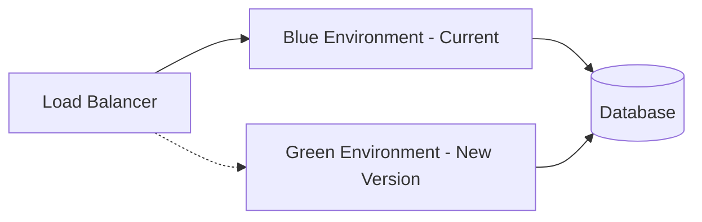
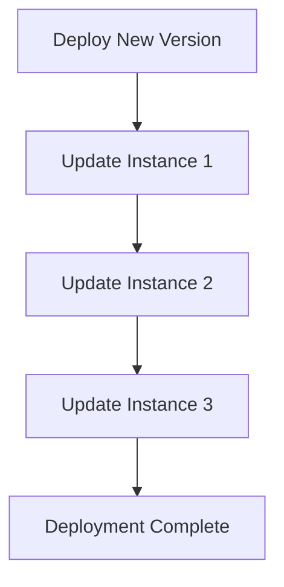
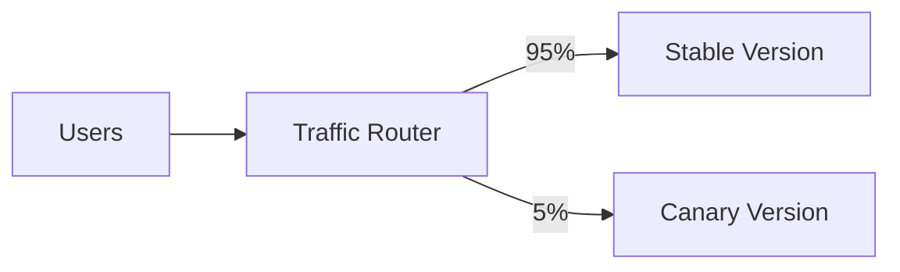

# Taxomind Deployment Overview

## Architecture Overview

Taxomind is an enterprise-grade Learning Management System built with Next.js 15, featuring a modern microservices-ready architecture designed for scalability, security, and high availability. The platform supports AI-powered adaptive learning, real-time analytics, and comprehensive role-based access control for students, teachers, and administrators.

## Technology Stack

### Core Technologies
- **Frontend**: Next.js 15.3.5 with App Router architecture
- **Backend**: Node.js 18+ with Next.js API Routes (100+ endpoints)
- **Database**: PostgreSQL 15 with Prisma ORM v6.13.0
- **Caching**: Redis/Upstash with rate limiting
- **Authentication**: NextAuth.js v5 beta with multi-provider support
- **File Storage**: Cloudinary for media management
- **AI Services**: OpenAI GPT-4, Anthropic Claude APIs

### Infrastructure Components
- **Container Orchestration**: Docker/Kubernetes
- **CI/CD**: GitHub Actions with automated testing
- **Monitoring**: Sentry, OpenTelemetry, Prometheus
- **Security**: WAF, DDoS protection, SSL/TLS, CSP headers
- **Message Queue**: BullMQ with Redis backend
- **Real-time**: Socket.io for live features
- **Observability**: Structured logging with Pino

## Deployment Environments

### 1. Development Environment
- **Purpose**: Local development and testing
- **Database**: PostgreSQL on port 5433 (Docker)
- **Features**: Hot reload, debug mode, seed data
- **Security**: Relaxed for development productivity

### 2. Staging Environment
- **Purpose**: Pre-production testing and QA
- **Database**: Dedicated PostgreSQL instance
- **Features**: Production-like configuration
- **Security**: STRICT_ENV_MODE enabled
- **Access**: Limited to QA and development teams

### 3. Production Environment
- **Purpose**: Live user-facing application
- **Database**: High-availability PostgreSQL cluster
- **Features**: Full enterprise features enabled
- **Security**: Maximum security, audit logging
- **Access**: Role-based with MFA required

## Deployment Strategies

### Blue-Green Deployment


**Benefits**:
- Zero-downtime deployments
- Easy rollback capability
- Production testing before cutover

### Rolling Deployment


**Benefits**:
- Gradual rollout
- Resource efficient
- Continuous availability

### Canary Deployment


**Benefits**:
- Risk mitigation
- Real-world testing
- Gradual feature rollout

## Infrastructure Architecture

### High-Level Architecture
```
┌─────────────────────────────────────────────────────────┐
│                       CDN Layer                          │
│                    (CloudFlare/Vercel)                   │
└─────────────────────────────────────────────────────────┘
                              │
┌─────────────────────────────────────────────────────────┐
│                    Load Balancer                         │
│                  (AWS ALB/Vercel Edge)                   │
└─────────────────────────────────────────────────────────┘
                              │
        ┌─────────────────────┴─────────────────────┐
        │                                            │
┌───────▼────────┐                       ┌──────────▼────────┐
│   Web Servers  │                       │   API Servers     │
│   (Next.js)    │                       │   (Next.js API)   │
└────────────────┘                       └───────────────────┘
        │                                            │
        └─────────────────────┬─────────────────────┘
                              │
        ┌─────────────────────┼─────────────────────┐
        │                     │                      │
┌───────▼────────┐    ┌───────▼────────┐   ┌───────▼────────┐
│   PostgreSQL   │    │     Redis      │   │   File Storage │
│    (Primary)   │    │    (Cache)     │   │  (Cloudinary)  │
└────────────────┘    └────────────────┘   └────────────────┘
```

## Security Layers

### 1. Network Security
- **WAF**: Web Application Firewall
- **DDoS Protection**: Rate limiting and traffic filtering
- **SSL/TLS**: End-to-end encryption
- **VPC**: Private network isolation

### 2. Application Security
- **Authentication**: Multi-factor authentication
- **Authorization**: Role-based access control (RBAC)
- **Session Management**: Secure JWT tokens
- **Input Validation**: Comprehensive sanitization

### 3. Data Security
- **Encryption at Rest**: Database encryption
- **Encryption in Transit**: TLS 1.3
- **Backup Strategy**: Automated encrypted backups
- **Audit Logging**: Comprehensive activity tracking

## Deployment Pipeline

### CI/CD Workflow
```yaml
1. Code Commit
   └── Trigger: Push to main/staging branch
   
2. Build Phase
   ├── Install dependencies
   ├── Run lint checks
   ├── Run tests
   └── Build application
   
3. Security Scan
   ├── Dependency vulnerability scan
   ├── Code security analysis
   └── Container image scan
   
4. Deploy to Staging
   ├── Database migrations
   ├── Deploy application
   └── Run smoke tests
   
5. Production Deployment
   ├── Manual approval required
   ├── Database migrations
   ├── Blue-green deployment
   └── Health checks
   
6. Post-Deployment
   ├── Monitor metrics
   ├── Alert on anomalies
   └── Generate deployment report
```

## Monitoring and Observability

### Key Metrics
- **Application Performance**
  - Response time (p50, p95, p99)
  - Error rate
  - Request throughput
  - Active users

- **Infrastructure Health**
  - CPU utilization
  - Memory usage
  - Disk I/O
  - Network throughput

- **Business Metrics**
  - User engagement
  - Course completion rates
  - API usage
  - Revenue metrics

### Monitoring Stack
```
Application → Metrics Collector → Time Series DB → Dashboards
     ↓              ↓                    ↓              ↓
   Logs      Alert Manager         Prometheus      Grafana
```

## Disaster Recovery

### Backup Strategy
- **Database**: Daily automated backups with 30-day retention
- **File Storage**: Redundant storage with versioning
- **Configuration**: Version controlled in Git
- **Secrets**: Encrypted backup in secure vault

### Recovery Objectives
- **RTO (Recovery Time Objective)**: < 4 hours
- **RPO (Recovery Point Objective)**: < 1 hour
- **Backup Testing**: Monthly restore tests
- **Failover Testing**: Quarterly DR drills

## Deployment Checklist

### Pre-Deployment
- [ ] Code review completed
- [ ] All tests passing
- [ ] Security scan clean
- [ ] Database migrations tested
- [ ] Environment variables configured
- [ ] Rollback plan prepared

### During Deployment
- [ ] Database backup taken
- [ ] Maintenance mode enabled (if needed)
- [ ] Database migrations applied
- [ ] Application deployed
- [ ] Health checks passing
- [ ] Smoke tests successful

### Post-Deployment
- [ ] Monitor error rates
- [ ] Check performance metrics
- [ ] Verify critical user flows
- [ ] Update documentation
- [ ] Notify stakeholders
- [ ] Archive deployment artifacts

## Environment-Specific Commands

### Development
```bash
npm run dev:docker:start
npm run dev:setup
npm run dev
```

### Staging
```bash
npm run enterprise:validate
npm run enterprise:deploy:staging
npm run enterprise:health
```

### Production
```bash
npm run enterprise:validate
npm run enterprise:deploy:production
npm run enterprise:health
npm run enterprise:audit
```

## Best Practices

### 1. Zero-Downtime Deployments
- Use blue-green or rolling deployments
- Implement graceful shutdown
- Maintain backward compatibility
- Use feature flags for gradual rollout

### 2. Database Migrations
- Always test migrations in staging first
- Keep migrations reversible
- Use transactions for data integrity
- Monitor migration performance

### 3. Configuration Management
- Use environment variables for configuration
- Never commit secrets to version control
- Validate configuration before deployment
- Use secret management services

### 4. Monitoring and Alerting
- Set up comprehensive monitoring
- Configure intelligent alerting
- Maintain runbooks for common issues
- Implement automated remediation where possible

## Support and Resources

### Documentation
- Technical documentation: `/docs/technical/`
- API documentation: `/docs/api/`
- Deployment guides: `/docs/deployment/`

### Contact Information
- DevOps Team: devops@taxomind.com
- Security Team: security@taxomind.com
- On-call Support: support@taxomind.com

### Emergency Procedures
- Production incidents: Follow incident response runbook
- Security breaches: Immediate escalation to security team
- Data loss: Initiate disaster recovery procedures

---

*Last Updated: January 2025*
*Version: 1.0.0*